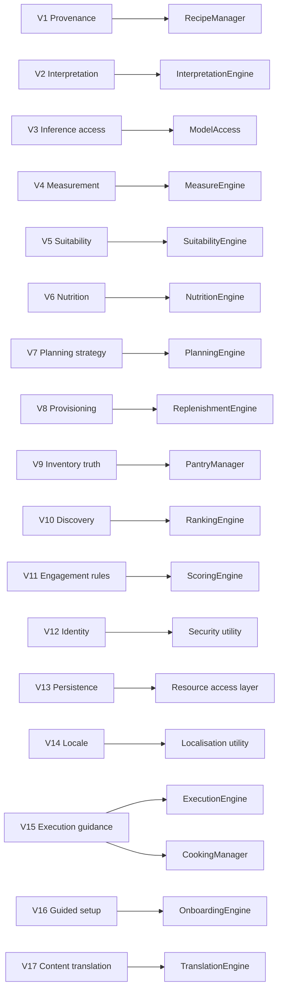

# Volatility analysis

**Status: reference document. Drives [Architecture](04-architecture.md).**

> The iDesign Method decomposes a system by *volatility*, not by function. Services encapsulate
> things that change. Requirements are satisfied by the interaction of services, never by a service
> per requirement.

This document does the analysis. It is the reason the architecture looks nothing like the feature
list in the root `README.md`, and it should be read before that architecture is judged.

## Why the feature list is not the architecture

The obvious decomposition writes itself straight off the feature list:

```
UserManager  RecipeManager  MealPlanManager  StockManager  ShoppingListManager
SocialManager  GamificationManager  AcademyManager  AIManager  SearchManager
```

This is functional decomposition, and it fails in a specific, predictable way. Ask what happens
when a single thing changes:

| A change arrives | Services it touches under functional decomposition |
| --- | --- |
| Preferred unit per ingredient kind (`de_CH` wants grams, a US user wants cups) | Recipe, MealPlan, Stock, ShoppingList — all four render quantities |
| A new dietary restriction is supported | Recipe, MealPlan, Social, AI, Search — all five filter by suitability |
| The inference provider changes from Ollama to Anthropic | AI, Recipe, Academy — anything that generates |
| Nutrition source is replaced | Recipe, MealPlan, Search, Social |
| Points rules are retuned | Recipe, MealPlan, Stock, Academy, Social — everything awards points |

Every row is a change that smears across services. That is the definition of bad encapsulation, and
it is why feature-shaped systems calcify: the fifth feature costs more than the first, because each
new feature must be threaded through every existing service.

Read the table the other way and it becomes an instruction. **The rows are the architecture.** Unit
conversion, dietary suitability, model access, nutrition, and scoring are each a single thing that
changes for a single reason. Each deserves exactly one home.

Two more failure modes of the functional decomposition, specific to this domain:

- **Managers would have to call each other.** `MealPlanManager` needs stock, which is
  `StockManager`, which needs the shopping list, which is `ShoppingListManager`. The call rules in
  the root `README.md` forbid Manager→Manager for good reason: that chain means a change to stock
  semantics propagates into planning, and neither can be tested alone.
- **`AIManager` is not a volatility, it is a technology.** Naming a service after a technology
  guarantees it becomes a dumping ground. What actually varies is *where inference runs* (a
  resource) and *how a request is composed and its output interpreted* (a business activity). Those
  are two different volatilities with two different rates of change, and they belong in two
  different layers.

## The two axes

Volatility is examined along the two axes the Method prescribes.

**Axis 1 — change over time**, for one installation over its life:

- Recipe input sources multiply: hand-authored, then JSON, then URLs, then photographs, then
  whatever comes next.
- Model capability and prompting technique change faster than anything else in the system.
- Gamification rules are retuned continuously; nobody gets points right the first time.
- Search moves from keyword to semantic to hybrid.
- Nutrition reference data is replaced as better sources become available.
- Dietary categories expand as understanding and fashion change.

**Axis 2 — change across installations**, at the same moment:

- Deployment shape: one cook on a home server, a family instance, a shared community instance.
- Inference: local Ollama, local vLLM, or a hosted API with the user's own key.
- Datastore: SQLite for a household, Postgres for anything larger.
- Media: local filesystem or object storage.
- Locale: `en_GB`, `de_CH`, `fr_CH` — differing in language, units, ingredient names, and what is
  actually available in shops.
- Household composition: a solo cook, a family with a toddler, a household with a severe allergy.
- Skill: a trained chef wants "reduce by half"; a beginner needs to know what that means.

Anything appearing on both axes is a strong candidate for its own service. Anything appearing on
neither is probably not worth encapsulating.

## The volatilities

Fourteen areas of volatility, each with the question it answers, what varies, and what is
deliberately *not* volatile about it.

### V1 Recipe provenance

**Question:** where did this recipe come from?
**Varies:** hand-authored, JSON import, website URL, photograph, AI synthesis from ingredients or
description, derivation from an existing recipe. New sources will keep arriving.
**Stable:** every path must end in the same canonical structure. Provenance is recorded, but a
recipe's usefulness never depends on its origin.
**Encapsulated by:** `RecipeManager` sequences acquisition; the sources themselves are resources.

### V2 Recipe interpretation

**Question:** how does unstructured content become canonical structure?
**Varies:** parsing scraped HTML, stripping narrative filler, reading model output, reconciling
ambiguous quantities ("a knob of butter"), inferring implicit steps, detecting the actual yield.
This is the product's core competence and will be refined indefinitely.
**Stable:** the canonical structure it produces.
**Encapsulated by:** `InterpretationEngine`.

Kept separate from V1 deliberately: the *sequence* of importing changes rarely, while the *quality
of interpretation* changes constantly.

### V3 Inference access

**Question:** which model answers, and how is it reached?
**Varies:** Ollama, vLLM, OpenAI, Anthropic, OpenRouter; local versus hosted; credentials, model
names, context limits, streaming support, cost, availability.
**Stable:** the system asks for a completion over a prompt and receives text or structured output.
**Encapsulated by:** `ModelAccess`.

### V4 Measurement

**Question:** what does this quantity mean, expressed how?
**Varies:** unit systems, per-user preferred unit *per ingredient kind*, mass/volume conversion
requiring per-ingredient density, yield scaling, non-linear scaling (seasoning does not double when
a recipe doubles), imprecise units ("a pinch").
**Stable:** a quantity is a magnitude and a unit against a known ingredient.
**Encapsulated by:** `MeasureEngine`.

Portion sizing lives here too. Two adults are not two identical appetites, so an eater carries a
multiplier and the required yield is the sum of the attending eaters' multipliers rather than a head
count. This is a worked example of the placement procedure below: appetite scaling *feels* like a
new feature, but it changes for the same reason and at the same rate as everything else about
quantities, so it extends V4 instead of earning a service.

This is the clearest example of the cross-cutting argument: measurement appears in recipes, plans,
stock, and shopping lists. Under feature decomposition it would live in all four.

### V5 Suitability

**Question:** can these people eat this?
**Varies:** allergens, intolerances, ethical and religious restrictions, medical diets, dislikes,
age-band appropriateness (infant, child, adult, elderly), and the severity attached to each — a
preference may be overridden, an anaphylactic allergy may not.
**Stable:** the evaluation is a pure function of a structured recipe and a set of structured eater
constraints.
**Encapsulated by:** `SuitabilityEngine`.

**This engine is safety-critical.** Per the [safety rule](01-vision.md#the-safety-rule), it derives
conclusions from structured ingredients only. It must never accept a claim made in generated text,
and it must be independently testable — which it is, being stateless and free of I/O.

### V6 Nutrition estimation

**Question:** what is in this, nutritionally?
**Varies:** the reference data source, how nutrients aggregate across ingredients, losses during
cooking, per-serving versus per-recipe basis, which nutrients are tracked, how confidence is
represented.
**Stable:** a recipe maps to a nutrient profile.
**Encapsulated by:** `NutritionEngine`, over data from `IngredientAccess`.

### V7 Planning strategy

**Question:** what should be eaten, when, given the constraints?
**Varies:** manual assignment, constraint-satisfying suggestion, optimisation for stock use, for
expiry, for nutritional balance, for variety, for effort on weeknights. Today a cook fills slots by
hand; the interesting version proposes.
**Stable:** a plan assigns recipes to slots over a period, with attending eaters per slot.
**Encapsulated by:** `PlanningEngine`, sequenced by `PlanningManager`.

### V8 Provisioning

**Question:** what must be bought, given what is needed and what is already here?
**Varies:** netting logic, aggregation across recipes, rounding to purchasable pack sizes,
substitution when an item is unavailable, grouping by shop layout or department, unit choice for
shopping as distinct from cooking.
**Stable:** requirement minus availability equals a list.
**Encapsulated by:** `ReplenishmentEngine`.

### V9 Inventory truth

**Question:** what is actually in the kitchen right now?
**Varies:** reservation versus consumption semantics, lot and expiry tracking, partial use, waste
with reasons, manual correction, whether depletion is inferred or recorded.
**Stable:** stock is a quantity of an ingredient with a provenance and possibly an expiry.
**Encapsulated by:** `PantryManager` over `PantryAccess`.

See [ADR-004](07-decisions.md#adr-004-plans-reserve-stock-cooking-consumes-it) — planning reserves,
cooking consumes. Conflating the two makes stock lie.

### V10 Discovery

**Question:** which recipes are relevant to this request?
**Varies:** keyword search, filtering, semantic similarity, hybrid ranking, ranking by pantry
coverage, by expiry urgency, by eater suitability, by personal history.
**Stable:** a query and a context produce an ordered set of recipes.
**Encapsulated by:** `RankingEngine` for order, `SearchIndexAccess` for retrieval.

Split deliberately: the index technology and the ranking policy change for entirely different
reasons and at entirely different rates.

### V11 Engagement rules

**Question:** what earns recognition, and who sees whose work?
**Varies:** point values, badge criteria, leaderboard periods and categories, follower semantics,
what sharing exposes, moderation. This is the most volatile area in the system and the least
consequential when it changes — which is exactly why it must not be entangled with anything else.
**Stable:** activity happens; rules interpret it.
**Encapsulated by:** `ScoringEngine` for rules, `EngagementManager` for sequence.

Scoring reacts to events published on the bus rather than being called by the services whose work
it scores. Otherwise every manager in the system would have to know about points, and FR-12 —
retuning rules without migrating history — becomes impossible.

### V12 Identity and authorisation

**Question:** who is asking, and what may they see?
**Varies:** authentication mechanism (JWT now, OIDC plausibly later), single-user versus
multi-user instances, visibility rules for private, shared, followed, and public content.
**Stable:** a request carries a principal; content carries a visibility.
**Encapsulated by:** the `Security` utility for the mechanism, `AccountManager` for the sequence
(bootstrap, registration, sign-in), and `CookAccess` for the accounts themselves.

### V13 Persistence and media

**Question:** where does the data physically live?
**Varies:** SQLite or Postgres; local filesystem or object storage for images; backup shape;
migration tooling. v1 ships SQLite only
([ADR-009](07-decisions.md#adr-009-sqlite-only-to-begin-with)) — the volatility is encapsulated now
so that the choice can change later without business logic noticing.
**Stable:** business operations expressed as atomic verbs over the domain.
**Encapsulated by:** the resource access layer, whose interfaces are stated in domain terms — not
as CRUD over tables.

### V14 Presentation locale

**Question:** in what language, units, and conventions is this shown?
**Varies:** UI language, ingredient naming per locale, unit conventions, date and number formats,
regional product availability.
**Stable:** content is stored locale-neutral and rendered locale-specific.
**Encapsulated by:** the `Localisation` utility and locale-aware naming in `IngredientAccess`.

### V15 Execution guidance

**Question:** how does a recipe become something a person can actually follow while cooking?
**Varies:** how mise-en-place is grouped (by step, by prep type, by station), how steps are ordered
and which can run in parallel, where timers belong and how long-lead work is surfaced ahead of time,
how much detail a step carries for a given skill level, how jargon is offered without interrupting,
and how a session survives interruption.
**Stable:** the recipe's ingredient lines and steps, which execution guidance reads but never
changes.
**Encapsulated by:** `ExecutionEngine` for the plan, `CookingManager` for the session.

This is genuinely distinct from V2 interpretation. Interpretation asks *what is this recipe*;
execution asks *how does a standing, distracted human get through it*. The same canonical recipe
supports both, and they will be refined by different people for different reasons — one against a
corpus of scraped pages, the other against people cooking dinner.

It is also the only volatility in the system with a real-time, stateful, device-spanning session,
which is why it earns a manager rather than living inside `RecipeManager`.

### V16 Guided setup

**Question:** what must exist before the product is useful, and how is a newcomer walked to it?
**Varies:** which setup steps exist, their order, which are mandatory, what counts as a complete
profile, how an instance bootstraps its first admin, and what seed content ships.
**Stable:** the underlying data being established — eaters, constraints, unit preferences, locale.
**Encapsulated by:** `OnboardingEngine`.

Deliberately an engine and not a manager: onboarding progress is *derived* from profile data rather
than stored as wizard state ([ADR-014](07-decisions.md#adr-014-onboarding-progress-is-derived-not-stored)),
which leaves nothing stateful to sequence. The engine answers "what is missing and what comes next"
as a pure function of the profile.

Instance bootstrap — creating the first admin on a fresh server — is a different thing wearing
similar clothes. It is an instance lifecycle concern, handled by the `Security` utility and closed
permanently once any user exists (FR-16).

### V17 Content translation

**Status: not built.** Recorded because Phase 3 made it unavoidable — see
[ADR-032](07-decisions.md#adr-032-proposed-recipes-are-stored-in-their-own-language-and-read-in-yours).

**Question:** how does a recipe written in one language get read in another?
**Varies:** which languages, whether a machine or a person does it, which model, whether a
translation is reviewed, whether it is done eagerly or on first request, and how a correction is
kept when the source changes.
**Stable:** a recipe holds text in the language it was written in, and a reader wants it in theirs.
**Encapsulated by:** `TranslationEngine` — a capability engine over `ModelAccess`, like
`InterpretationEngine`.

Deliberately not V14. That volatility is about *interface* strings: authored by us, shipped as
catalogues, fixed at build time. This is user content translated at runtime, and the two change for
entirely different reasons — a new interface string is a commit, a new recipe is a Tuesday.

Deliberately not V2 either. Interpretation turns *unstructured* content into structure. Translation
takes structure and renders it in another language. A recipe that has already been read correctly
still needs this, and a recipe nobody translates is still perfectly usable.

## Volatility to service map



## What is deliberately not a service

Encapsulation has a cost. These were considered and rejected, because they do not vary
independently of something that already has a home:

| Candidate | Why not |
| --- | --- |
| ~~`UserManager`~~ | **Rejected, then reinstated as `AccountManager`.** The claim that account lifecycle was too thin for a manager did not survive contact with the code: a Client may not call Resource Access directly, so there was no legal shape for the account endpoints without one, and the sign-in sequence turned out not to be empty. See [ADR-021](07-decisions.md#adr-021-account-management-does-need-a-manager). |
| `TagManager` | Tags do not vary independently of recipes. |
| `ImageManager` | Storing bytes is `MediaAccess`. Interpreting a photograph into a recipe is V2. Nothing remains in between. |
| `ShoppingListManager` | A shopping list is an output of V8, not a thing with its own lifecycle. Making it a manager forces Manager→Manager calls with planning. |
| `AcademyManager` | Academy content is authored and read. The interesting part — contribution earning recognition — is V11, and lives in `EngagementManager`. |
| `NotificationManager` | Delivery is a utility concern over the event bus. |
| `SeedManager` | Seed content is data, not behaviour. It is loaded by a CLI command through the ordinary resource access services, and varies with locale (V14) and storage (V13) — both of which already have homes. See [ADR-016](07-decisions.md#adr-016-ship-seed-content-marked-and-upgradable). |
| `TimerManager` | A timer is a field on a step and a start time on a session. The volatility is *where timers belong in a recipe*, which is V15. Ticking is the client's job. |

Each rejection is reversible. The test for promoting one later is unchanged: *does it vary for its
own reasons, at its own rate?*

## How to use this document

When a new feature is proposed, do not ask which service owns it. Ask:

1. What varies here, and why?
2. Does an existing volatility already cover it? If yes, the feature is an addition to an existing
   service, not a new one.
3. If it is genuinely new, does it vary on both axes? If it varies on neither, do not encapsulate
   it.
4. Which layer does it belong to — a workflow sequence (Manager), a stateless activity (Engine),
   access to something external (Resource Access), or a cross-cutting concern (Utility)?

A feature that cannot be placed by this procedure is usually a feature that has not been understood
yet.
