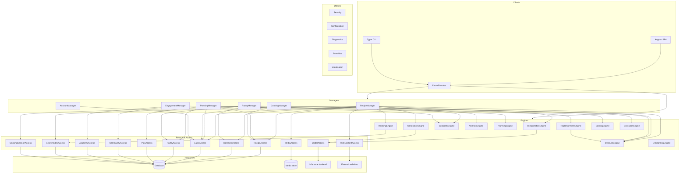
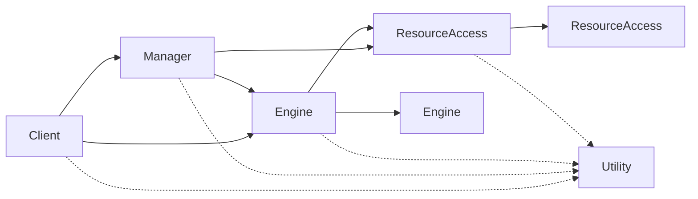
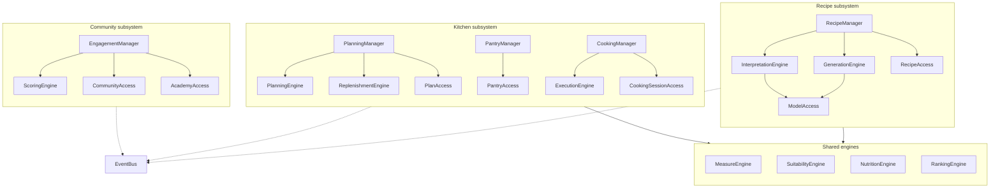

# Architecture

**Status: Planned. The repository currently contains the template scaffold and one status endpoint.**

This document defines the services, the layers they occupy, the rules governing calls between them,
and how that maps onto the code. It follows directly from the
[volatility analysis](03-volatility-analysis.md) — every service here exists because something
identified there changes.

## Layers

Quookly uses the iDesign layering stated in the root `README.md`:

| Layer | Encapsulates | Contains state? | Naming |
| --- | --- | --- | --- |
| **Client** | Entry points that initiate interaction | No | API routes, Angular pages, CLI commands |
| **Manager** | The *sequence* of a use case family | Yes, workflow state | `*Manager` |
| **Engine** | A stateless business activity | No | `*Engine` |
| **Resource Access** | Access to a resource, in domain verbs | No | `*Access` |
| **Resource** | The thing itself | — | Database, filesystem, model server, websites |
| **Utility** | Cross-cutting concerns | Varies | `Security`, `EventBus`, … |

Two rules deserve emphasis, because they are the ones most often violated in practice:

**Managers sequence; they do not compute.** If a manager contains a business rule, that rule belongs
in an engine. A manager that is doing arithmetic has absorbed a volatility it should have delegated.

**Resource access speaks domain, not storage.** `PantryAccess.reserve(ingredient, quantity, plan)`
is correct. `PantryAccess.update_stock_row(id, fields)` is not — it leaks the storage model upward
and forces callers to know about rows, defeating V13.

## The static view



Utilities are omitted from the arrows above; by definition every layer may use them, and drawing
that would obscure the structure rather than explain it.

## Call rules



Permitted, restated as prohibitions — these are the ones that get enforced:

- A Manager must never call another Manager. Use the event bus.
- An Engine must never call a Manager.
- Resource Access must never call an Engine or a Manager.
- A Client must never call Resource Access directly. A route therefore cannot decide which language
  a cook reads in — it does not have the account. Reading language is resolved by the manager, which
  is why `DEFAULT_LOCALE` no longer exists in `routes/`.
- A Utility must never call a Manager, Engine, or Resource Access.

The last rule is what keeps utilities usable everywhere: the moment `Security` calls `EaterAccess`,
it stops being a utility and becomes a layered service with a dependency cycle waiting to happen.
Where a utility genuinely needs data, it receives it as an argument.

`InterpretationEngine` is the first **capability engine**: it mediates one external
capability — the model — and so reaches resource access by design (ADR-003). The
import-linter contract that used to name `quookly.engines` wholesale now lists the *rule*
engines one at a time. That break was predicted in the contract's own comment and happened
exactly when the first capability engine arrived. Listing them individually is the point:
adding an engine does not quietly grant it I/O, and a new capability engine is added by
being *left out* of the list, which is a line in a review rather than a silence.

The "never skip a layer downward" rules need contracts of their own. `import-linter`'s
layers contract forbids a lower layer importing a higher one, but permits a layer to reach
past the one below it — so *Client must not call Resource Access* and *Engine must not call
Resource Access* are each stated separately. The first of those was missing until Phase 2,
and a route had already taken the shortcut.

These rules are mechanically enforced — see
[ADR-008](07-decisions.md#adr-008-enforce-the-call-rules-with-import-linter). The template already
anticipates this: `just backend clean` removes `.import_linter_cache`.

## Managers

Six managers. The count is deliberate: the Method warns that a manager per entity is functional
decomposition wearing a costume, and each manager here corresponds to a family of use cases that
sequences independently of the others. `CookingManager` was added after the original four; the test
it had to pass, and the reasoning, are in
[ADR-002](07-decisions.md#adr-002-four-managers-not-one-per-entity).

### RecipeManager

**Volatility:** V1 provenance, and the sequencing of V2 and V10.
**Use cases:** UC-1.*, UC-2.*, UC-3.*
**Sequences:** acquire raw input → interpret to canonical structure → resolve ingredients against
the registry → validate → compute derived facts → persist → index. Also sequences the read and
discovery paths: gathering the reference data a rule engine needs before asking it to render, rank,
or judge.

Every acquisition path converges on the same sequence after its first step. Adding a source means
adding one branch at the front, not a new workflow.

Discovery lives here rather than in a manager of its own because finding a recipe does not vary
independently of recipes themselves — the volatility that *does* vary independently is ranking
policy, and that is `RankingEngine`.

### PlanningManager

**Volatility:** sequencing of V7.
**Use cases:** UC-4.1–UC-4.4
**Sequences:** establish period and slots → resolve attending eaters → propose or accept recipe
assignments → verify suitability → reserve stock → derive shopping list.

### PantryManager

**Volatility:** V9 inventory truth.
**Use cases:** UC-4.5, UC-5.*
**Sequences:** receive stock → reserve against plans → consume on cooking → expire → record waste.

Separate from `PlanningManager` because stock is true independently of whether anyone is planning:
a cook adjusts the pantry constantly outside any plan, and expiry advances whether or not the app
is opened.

### CookingManager

**Volatility:** V15 execution guidance, and the only session state in the system.
**Use cases:** UC-9.*
**Sequences:** start a session for a recipe and attending eaters → scale to the summed appetite
multipliers → derive the execution plan → track progress and timer state → complete, releasing a
`MealCooked` fact, or abandon, releasing reservations.

The session is server-side (FR-13), which is what makes UC-9.7 — resume on another device — work at
all. Timers tick on the client; the server holds the start instant and the paused accumulation, so a
locked phone or a switched device does not lose a reduction.

On completion `CookingManager` publishes `MealCooked` rather than consuming stock itself.
`PantryManager` owns inventory truth (V9) and subscribes. This is the Manager→Manager prohibition
doing useful work: cooking does not need to know how stock accounting is done, and stock accounting
does not need to know cooking mode exists.

### AccountManager

**Volatility:** the sequencing of V12 identity and authorisation.
**Use cases:** UC-6.1, UC-10.1
**Sequences:** claim a fresh instance with its first admin, closing that path permanently; register
an account; exchange credentials for a token.

Added after the original four were named, reversing part of
[ADR-002](07-decisions.md#adr-002-four-managers-not-one-per-entity) — see
[ADR-021](07-decisions.md#adr-021-account-management-does-need-a-manager). The mechanism stays in the
`Security` utility; what lives here is the order things happen in.

### EngagementManager

**Volatility:** sequencing of V11.
**Use cases:** UC-7.*
**Sequences:** react to activity events → apply scoring rules → award points and badges → maintain
the social graph, ratings, comments, and Academy contributions.

Driven by subscription to the event bus rather than by direct calls from other managers. This is
what allows scoring rules to change without touching a single line in recipe or planning code.

## Engines

| Engine | Volatility | Responsibility |
| --- | --- | --- |
| `InterpretationEngine` | V2 | Unstructured content to canonical recipe. Filler removal, quantity resolution, step extraction. |
| `GenerationEngine` | V1, V3 | Composes prompts for synthesis; parses and constrains model output. Knows *what to ask*, never *whom to ask*. |
| `MeasureEngine` | V4 | Unit conversion, density-aware mass/volume, yield scaling, portion sizing from appetite multipliers, preferred-unit rendering. |
| `SuitabilityEngine` | V5 | Evaluates a structured recipe against structured eater constraints. Safety-critical. |
| `NutritionEngine` | V6 | Aggregates nutrient profiles; per-serving and per-recipe bases. |
| `PlanningEngine` | V7 | Proposes assignments satisfying constraints and objectives. |
| `ReplenishmentEngine` | V8 | Nets requirement against availability; aggregates and rounds a shopping list. |
| `RankingEngine` | V10 | Orders candidate recipes by relevance, pantry coverage, and expiry urgency. |
| `ScoringEngine` | V11 | Applies point and badge rules to activity. |
| `ExecutionEngine` | V15 | Turns a scaled recipe into an execution plan: mise-en-place groups, ordered steps, parallelism, timer specifications, technique links. |
| `OnboardingEngine` | V16 | Given a profile's current state, reports what is missing and what comes next. |

Every engine is **stateless**. Beyond that they divide into two kinds, and the distinction is
load-bearing:

**Rule engines** — `MeasureEngine`, `SuitabilityEngine`, `NutritionEngine`, `PlanningEngine`,
`ReplenishmentEngine`, `ScoringEngine`, `ExecutionEngine`, `OnboardingEngine` — are pure functions. They perform no I/O; every input,
including reference data such as densities and nutrient profiles, arrives as an argument. This is
what makes `SuitabilityEngine` testable to the standard its safety role demands: no fixtures, no
database, no network, just inputs and a verdict. A rule engine that grows a resource-access call has
stopped being a rule engine, and the safety argument goes with it.

**Capability engines** — `InterpretationEngine`, `GenerationEngine`, `RankingEngine` — mediate an
external capability and call Resource Access directly, which the call rules permit. Each owns
exactly one: the model, the model, the index. They hold no state either; they simply cannot do their
job without reaching the thing they mediate.

`GenerationEngine` and `ModelAccess` are the split described in
[V3](03-volatility-analysis.md#v3-inference-access). Prompt strategy changes weekly; provider
plumbing changes when someone switches backends. Different reasons, different rates, different
services.

## Resource access

Each service exposes atomic business verbs. Illustrative, not exhaustive:

| Service | Resource | Verbs |
| --- | --- | --- |
| `RecipeAccess` | Database | `store`, `fetch`, `list_for_cook`, `publish`, `derive_variant` |
| `IngredientAccess` | Database | `resolve_by_name`, `nutrients_for`, `density_for`, `localised_name` |
| `EaterAccess` | Database | `add`, `fetch`, `list_for_cook`, `for_ids`, `amend`, `restate_constraints`, `remove` |
| `PantryAccess` | Database | `receive`, `reserve`, `release`, `consume`, `record_waste`, `expiring_before` |
| `PlanAccess` | Database | `store_plan`, `fetch_plan`, `assign_slot`, `mark_cooked` |
| `CommunityAccess` | Database | `follow`, `rate`, `comment`, `award`, `leaderboard` |
| `AcademyAccess` | Database | `fetch_term`, `store_contribution`, `list_modules` |
| `ModelAccess` | Inference backend | `complete`, `complete_structured`, `describe`, `reachable` ([ADR-026](07-decisions.md#adr-026-one-openai-shaped-wire-format-not-a-provider-plugin-system)) |
| `WebContentAccess` | External websites | `fetch_readable` — prose and embedded metadata, neither preferred ([ADR-027](07-decisions.md#adr-027-an-instance-will-not-fetch-its-own-network), [ADR-028](07-decisions.md#adr-028-structured-metadata-is-fetched-not-preferred)) |
| `MediaAccess` | Media store | `store_image`, `fetch_image`, `delete_image` |
| `SearchIndexAccess` | Index | `index_recipe`, `query`, `remove` |
| `CookingSessionAccess` | Database | `open_session`, `fetch_active`, `advance_step`, `record_timer`, `close_session` |

`ModelAccess` is where V3 dies. One implementation per provider behind one interface; the choice is
configuration. No service above this layer may name a provider, and none may assume streaming,
tool-calling, or a context window size.

`WebContentAccess` returns readable content, not HTML. Interpreting that content is V2 and belongs
to the engine — otherwise scraping quirks would leak into business logic.

## Utilities

| Utility | Responsibility |
| --- | --- |
| `Security` | Token issue and verification; principal resolution; visibility predicates |
| `Configuration` | Typed settings from environment and config file; provider credentials |
| `Diagnostics` | Structured logging, tracing, health |
| `EventBus` | Publish and subscribe for activity events |
| `Localisation` | Message catalogues, locale resolution, unit conventions per locale |

### The event bus and why it exists

The bus is not decoration. It is the mechanism that makes the Manager→Manager prohibition
survivable, and it earns its place in exactly the cases where a naive design would reach sideways:

- A recipe is published → engagement awards points.
- A meal is cooked → pantry consumes reserved stock; engagement awards points.
- Stock nears expiry → discovery surfaces recipes that would use it.

Without the bus, `RecipeManager` would call `EngagementManager`, and scoring would become a
dependency of recipe publication — meaning FR-12, retuning scoring without touching history or
publication code, would be unachievable.

Events are facts in the past tense: `RecipePublished`, `MealCooked`, `StockExpiring`,
`ContributionAccepted`. A publisher states what happened and does not know or care who listens.

## Subsystem view

Grouping services by the volatility family they serve, as vertical slices through the layers:



The shared engines block is the payoff of the whole analysis. Measurement, suitability, nutrition,
and ranking are used by every subsystem and owned by none — precisely the concerns that the
functional decomposition would have smeared across every feature service.

## Code layout

The package skeleton is **Built**; the services inside it are **Planned**:

```
backend/src/quookly/
├── api.py                  # app construction (Built)
├── routes/                 # Client services — thin, no business logic (Partial)
│   ├── status.py           # (Built)
│   ├── accounts.py         # bootstrap, register, sign in (Built)
│   ├── recipes.py          # author, list, present, import, export (Built)
│   ├── ingredients.py      # searching the registry (Built)
│   ├── eaters.py           # the household a cook cooks for (Built)
│   ├── setup.py            # guided setup and its declarations (Built)
│   ├── instance.py         # what this instance is pointed at (Built)
│   ├── preferences.py      # unit preferences (Built)
│   ├── dependencies.py     # resolving the caller (Built)
│   ├── plans.py            # (Planned)
│   ├── pantry.py           # (Planned)
│   └── community.py        # (Planned)
├── managers/
│   ├── account.py          # bootstrap, registration, sign-in (Built)
│   ├── recipe.py           # authoring, listing, presenting, judging (Built)
│   ├── eater.py            # households, and keeping them apart (Built)
│   ├── ingredient.py       # finding registry entries to name (Built)
│   ├── instance.py         # reporting on the instance itself (Built)
│   ├── onboarding.py       # gathering a profile to be assessed (Built)
│   ├── preferences.py      # a cook's units, choice or default (Built)
│   └── seed.py             # stocking a fresh instance (Built)
├── engines/
│   ├── measure.py          # units, conversion, scaling (Built)
│   ├── exchange.py         # the interchange format (Built)
│   ├── interpretation.py   # content to canonical structure (Built) — capability engine
│   ├── onboarding.py       # what is still missing from setup (Built)
│   └── suitability.py      # can these people eat this (Built)
├── access/
│   ├── database.py         # async engine and session (Built)
│   ├── ingredient.py       # the registry, in domain verbs (Built)
│   ├── recipe.py           # recipes, whole (Built)
│   ├── eater.py            # eaters and their constraints (Built)
│   ├── setup.py            # answers given during setup (Built)
│   ├── model.py            # reaching an inference provider (Built)
│   ├── web.py              # fetching and reducing a page (Built)
│   ├── preferences.py      # a cook's unit preferences (Built)
│   ├── models.py           # SQLModel tables — never leave this layer (Built)
│   └── cook.py             # cook accounts, in domain verbs (Built)
├── utilities/
│   ├── configuration.py    # typed settings (Built)
│   ├── security.py         # password hashing, bearer tokens (Built)
│   └── diagnostics.py      # structured logging, request correlation (Built)
├── contracts/
│   ├── accounts.py         # Registration, Credentials, Authenticated (Built)
│   ├── cook.py             # Cook, StoredCredential (Built)
│   ├── ingredient.py       # Ingredient, IngredientKind, Origin (Built)
│   ├── recipe.py           # Recipe, IngredientLine, Step, drafts (Built)
│   ├── preferences.py      # UnitPreferences (Built)
│   ├── exchange.py         # the portable document (Built)
│   ├── eater.py            # Eater, Constraint, Severity, AgeBand (Built)
│   ├── onboarding.py       # SetupStep, ProfileState, SetupProgress (Built)
│   ├── inference.py        # Completion, ProviderStatus (Built)
│   ├── interpretation.py   # InterpretedRecipe, Source (Built)
│   ├── web.py              # ReadableContent (Built)
│   ├── suitability.py      # Outcome, Finding, Verdict (Built)
│   ├── measure.py          # Dimension, Unit, Quantity (Built)
│   ├── security.py         # Principal (Built)
│   └── errors.py           # errors that cross layers (Built)
└── ../alembic/             # migrations; the schema of record (Built)
```

Each layer package carries a docstring stating what it encapsulates and what it may not import. The
boundaries between them are enforced by `import-linter` in `just backend check`
([ADR-008](07-decisions.md#adr-008-enforce-the-call-rules-with-import-linter)), and
`backend/tests/test_architecture.py` verifies the enforcement actually rejects violations.

`contracts/` holds the data shapes passed between layers. It depends on nothing else in the
package, which is what allows engines to be pure and keeps the layers from importing each other for
type definitions alone.

Rules for `routes/`:

- A route resolves the principal, calls one manager or engine, and returns. Nothing else.
- Route function names are the public client API — `create_recipe` becomes `createRecipe` in
  Angular. They must be unique within their tag. See the root `README.md`.
- Every route declares an explicit `response_model` and return annotation.

## Frontend architecture

The Angular application mirrors the same discipline, one layer down:

| Angular concept | Corresponds to |
| --- | --- |
| Routed feature components (`features/`) | Client |
| Feature stores — signal-based state | Manager |
| Pure functions and computed signals | Engine |
| Generated API services (`@api`) | Resource Access |

Auth state lives in `core/auth/`: a signal-based `AuthStore` holding the session, an
`HttpInterceptorFn` attaching the bearer token, and route guards. The store persists to
`localStorage` defensively — private browsing, a disabled store, or a half-written value from an
older version must mean "nobody is signed in", never a blank screen.

The generated client is the *only* thing that talks to the backend. No component issues an HTTP
call directly, and no hand-written DTOs exist. Shared cross-feature components live in `core/`;
feature areas live in `features/` and are lazy-loaded.

A deliberate constraint follows from the safety rule: the frontend never *decides* suitability. It
displays what the backend computed. Duplicating that logic in TypeScript would create a second
implementation of a safety-critical rule, guaranteed to drift.

### Appearance

[Design language](11-design-language.md) is authoritative for how the interface looks, behaves, and
is themed. Two rules bind the code:

- **Components consume design tokens and nothing else.** A hardcoded colour, font, or spacing value
  silently opts out of theming ([ADR-023](07-decisions.md#adr-023-theming-by-design-tokens-themes-as-data)).
- **No component library.** Primitives are ours; behaviour that is easy to get inaccessibly wrong
  comes from `@angular/cdk`
  ([ADR-024](07-decisions.md#adr-024-own-component-primitives-on-cdk-behaviour)).

Theme selection lives in `core/theme/`: a signal store resolving `system` against
`prefers-color-scheme`, persisting the choice, and applying `data-theme` to the document root. It
also points the browser's own chrome at the theme's surface colour, read from the applied stylesheet
so themes stay the single source of truth.

Locale lives in `core/locale/`, and is deliberately plain functions rather than an injectable: it
resolves before bootstrap, because `$localize` catalogues load once and `LOCALE_ID` is fixed for the
lifetime of the application ([ADR-025](07-decisions.md#adr-025-runtime-locale-localize-catalogues-one-artefact)).

### Mobile is the design target

Per NFR-11, the phone is where Quookly is used: in a shop, at a worktop, holding something in the
other hand. The desktop is where it is built. Layouts are therefore authored at the narrow viewport
and widened, never the reverse.

What that changes in practice:

- **Breakpoints go up, not down.** Base styles are the phone; media queries add width. A component
  that only works once a media query has fired is a bug.
- **One-handed reach.** Primary actions sit within thumb reach at the bottom of the viewport, not in
  a top toolbar.
- **Touch targets** of at least 44 px, which also serves the accessibility requirement (NFR-7).
- **Installable.** A service worker and manifest make Quookly a PWA
  ([ADR-015](07-decisions.md#adr-015-mobile-first-installable-and-offline-where-it-matters)), which
  is what delivers NFR-13: the active recipe, the running cooking session, and the shopping list
  keep working when the signal does not.

### Cooking mode is a distinct presentation

Cooking mode is not the recipe page with bigger text. The cook is standing, hands occupied,
possibly wet, glancing from a metre away. It is built as its own routed feature with its own rules:

- One step fills the screen. No scrolling to find the current instruction.
- The [Screen Wake Lock API](https://developer.mozilla.org/en-US/docs/Web/API/Screen_Wake_Lock_API)
  holds the display on for the duration of the session, released on completion or abandonment
  (NFR-12).
- Timers render from server-held start instants, so a locked screen or a switched device resumes
  correctly. The client ticks; it is not the source of truth.
- Technique lookup opens over the current step and dismisses back to it. Navigating away from the
  step to read what "deglaze" means loses the cook's place, which is the failure this feature
  exists to prevent.
- Session progress is written through as it advances rather than at the end. A dropped connection
  mid-recipe must not discard the session.

## Where the CLI fits

The Typer CLI is a Client, on equal footing with the SPA. It talks to the same API through the
generated Python client and holds no business logic. Its purpose is operational: install-time
setup, bulk import and export, health checks, and administrative tasks that do not deserve UI.
