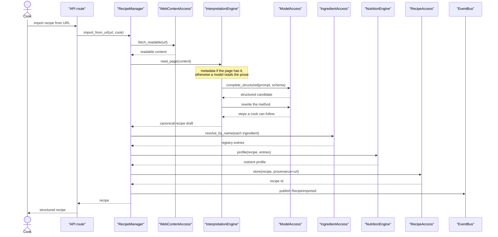
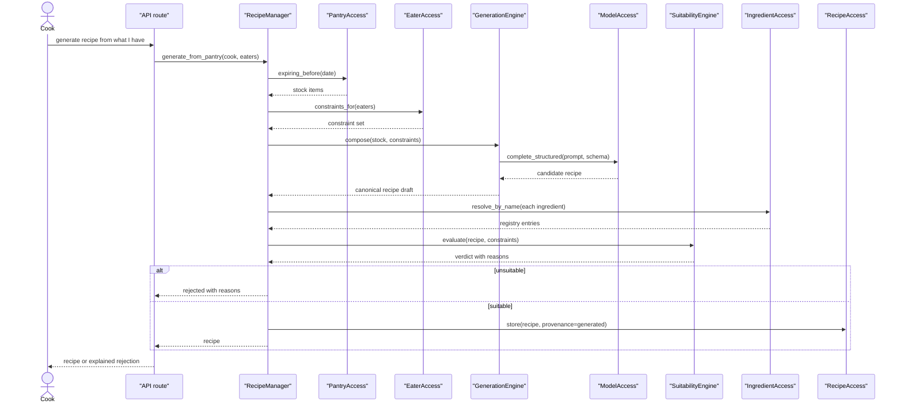
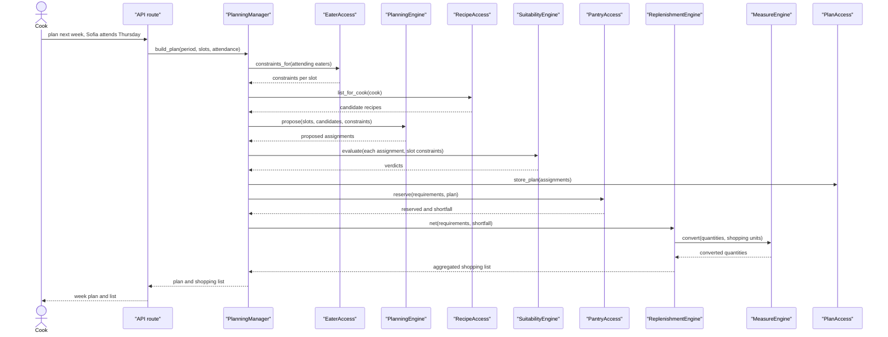
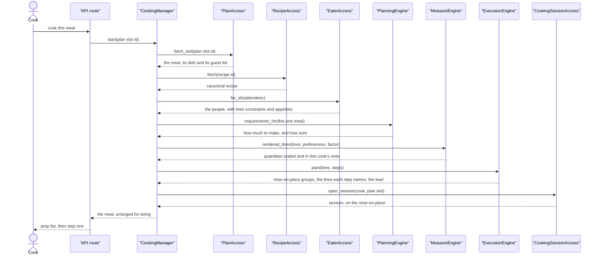
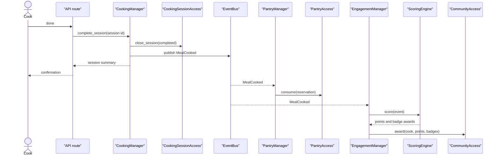
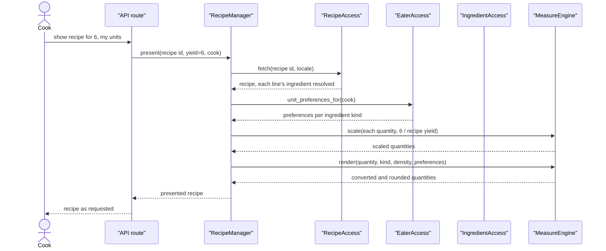
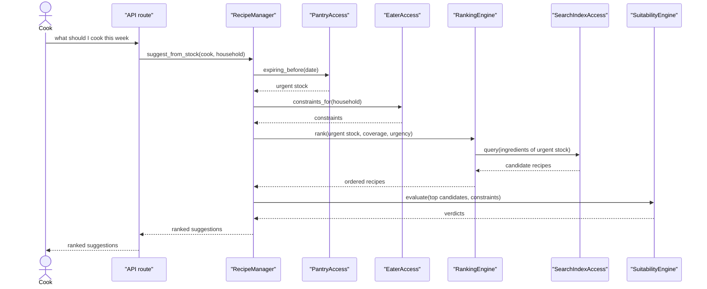
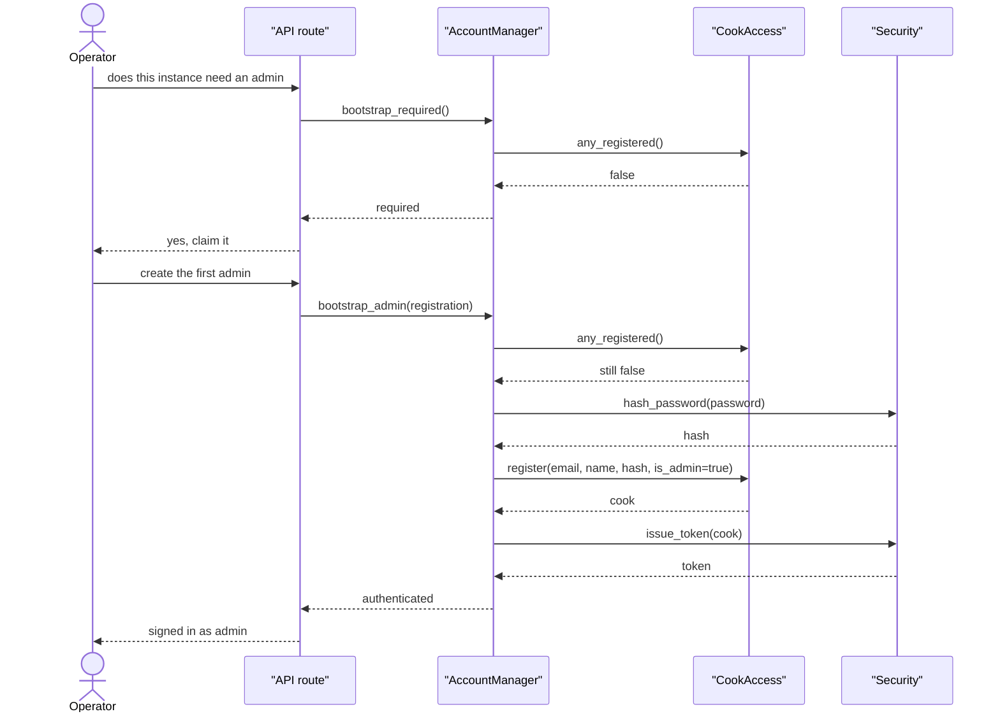
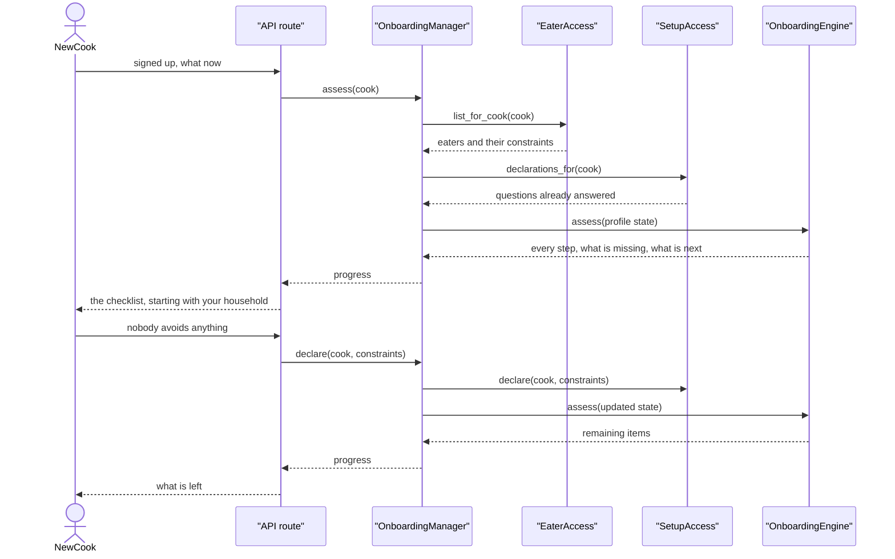

# Use case flows

**Status: Planned.**

> Requirements are not represented by subsystems, but by the interaction of services.

These sequences show how the services in [Architecture](04-architecture.md) collaborate to satisfy
the use cases in [Requirements](02-requirements.md). They are the proof that the decomposition
works: if a requirement cannot be satisfied by services calling each other within the
[call rules](04-architecture.md#call-rules), the decomposition is wrong.

Utilities are omitted unless they carry the point of the diagram.

## UC-1.3 Import a recipe from a URL

The founding use case. A cook pastes a link to a recipe buried in a thousand words of preamble.

Four things worth noting:

- `ModelAccess` is asked for *structured* output against a schema. The model fills a shape; it does
  not author the shape.
- **The method is edited, whichever way it was read**
  ([ADR-043](07-decisions.md#adr-043-a-pages-method-is-edited-on-the-way-in)). A page's
  instructions are written to be read on a sofa; carried through verbatim they are the thing this
  product exists to replace. The edit is one pass over both readings, because "what does a cook
  actually do" is one question.
- Ingredient resolution happens against the registry, not against model output. An unresolvable
  ingredient is reported (FR-9), never invented.
- Nothing here knows which provider served the completion.

## UC-1.4 Generate a recipe from pantry stock

**This is the safety rule in mechanical form.** The constraints are passed *into* generation to
improve the odds, and then the result is independently evaluated by `SuitabilityEngine` against the
resolved structured ingredients. A model asserting "this is dairy-free" carries no weight; the
verdict comes from the ingredient set. Generation and judgement are separate services precisely so
that the judgement cannot be talked out of its conclusion.

## UC-4.1 to UC-4.4 Plan a week with guests, and shop for it

The plan reserves rather than consumes ([ADR-004](07-decisions.md#adr-004-plans-reserve-stock-cooking-consumes-it)).
The shopping list is derived from the *shortfall* the reservation reports, so it is correct by
construction rather than by a second calculation that could disagree.

Note `ReplenishmentEngine` calling `MeasureEngine` — an Engine calling an Engine, permitted by the
call rules. Shopping units differ from cooking units: a recipe wants 150 g of butter, a shop sells
250 g blocks.

**Built, with one departure.** `PlanningEngine.propose` is not there: a cook fills slots by hand
today, and what the engine does instead is *size* each meal to the people at it — the volatile part
that planning actually needed first. Proposing arrives with generation (Phase 6).

Two other things the diagram does not show. Every change to a plan releases its claims and makes
them again ([ADR-038](07-decisions.md#adr-038-a-plans-reservations-are-restated-not-adjusted)), so
the loop above runs whole on each edit. And the shopping list is read back from the reservations
rather than netted a second time — the diagram's `RE: net(...)` decides what to reserve, and what
those reservations do not cover is the list.

## UC-9 Cooking mode, start to finish

Two flows: opening a session, and completing it. Together they replace what used to be a single
"mark as cooked" action, and they are where the event bus earns its keep.

### UC-9.1 and UC-9.2 Start a session and get the mise-en-place

A session is opened for a **planned meal**, not for a bare recipe
([ADR-042](07-decisions.md#adr-042-a-cooking-session-executes-a-planned-meal)). The plan is where a
meal is already recorded, where its guest list lives, and where its stock is held aside; cooking
something unplanned means putting it on today's plan first, which is one form the cook already has.

### UC-9.1b Cook a recipe that was never planned

`POST /cooking/sessions/for-recipe` — "Start cooking now", from the recipe itself. The route composes
two managers, which is what a route is for:

1. `PlanManager.slot_for_now` finds the plan covering today, or opens a one-day plan if there is
   none, and **places** the meal there — through `place`, so the meal is provisioned exactly as a
   planned one is. The day is today; the meal comes from `PlanningEngine.meal_at`, which reads it off
   the clock. Nobody is seated: the cook is looking at the recipe as written, and rescaling it to the
   household between one screen and the next would change the quantities they just read.
2. `CookingManager.start` opens the session on that slot, by the path above.

From there it is a session like any other — the same prep list, steps, timers and completion. What
was cooked on a whim therefore appears in the week's record, and what it used comes out of the
pantry, without either manager learning about the other.

The yield is the **sum of the attending eaters' appetite multipliers**, not the head count (FR-18) —
worked out by `PlanningEngine`, the same rule and the same code that sized the meal when it was
planned. A session and the shopping list that bought for it therefore cannot come to different
conclusions about how much to make.

`ExecutionEngine` answers in **positions**, not content: everything it says about ingredient lines it
says as an index into the recipe's own list. The manager pairs those with the quantities
`MeasureEngine` already rendered.

That is stronger than the rule it replaces. This flow used to hand the engine an already-scaled
recipe with a note saying it must never scale one; an engine that returns indices *cannot*, so V4
stays in one place by construction rather than by a promise
([ADR-040](07-decisions.md#adr-040-a-steps-ingredients-are-read-out-of-its-words-not-tagged)).
Appetite handling therefore has exactly one implementation, used identically by planning, shopping
and cooking.

### UC-9.6 Complete the session

`CookingManager` publishes a fact and returns; the cook is not kept waiting on stock accounting or
scoring. `PantryManager` still owns inventory truth (V9) and `EngagementManager` still owns scoring
(V11) — neither knows cooking mode exists, and cooking mode knows nothing of either.

Abandoning a session (UC-9.8) publishes **nothing**. It is still a first-class outcome rather than a
timeout — the difference between food that was eaten and food that was not is the difference the
pantry turns on — but there is no fact for anyone else to act on: the meal is still planned, so it
keeps its claim, and releasing what it was holding would take it off the shopping list at the same
time. The reservation is let go when the *meal* is, not when a cook puts the pan down
([ADR-038](07-decisions.md#adr-038-a-plans-reservations-are-restated-not-adjusted),
[ADR-042](07-decisions.md#adr-042-a-cooking-session-executes-a-planned-meal)).

`EngagementManager` and `ScoringEngine` are drawn here as the second listener they will be; neither
exists yet. The bus already carries `MealCooked` to the pantry, and adding them is a subscription
rather than a change to anything above.

## UC-2.1 and UC-2.2 View a recipe scaled and in preferred units

`MeasureEngine` receives densities and preferences as arguments rather than fetching them. That is
what keeps it pure and exhaustively testable — the same property that matters most for
`SuitabilityEngine`. Gathering the inputs is sequencing, and sequencing is the manager's job.

**Corrected against the implementation.** This flow originally showed a separate call to
`IngredientAccess` for densities. In practice a line's ingredient — density included — arrives with
the recipe, because a recipe is fetched whole. One fewer round trip, and one fewer thing for a
manager to coordinate.

## UC-3.4 Find recipes that use what is about to expire

Waste reduction as a ranking input rather than a feature bolted on: urgency is a signal into
`RankingEngine`, which is where V10 already lives.

## UC-10.1 Claiming a fresh instance

**Built.** The first flow in the system to exist rather than be designed.

The window closes against **any** account, not just an admin one — otherwise an instance somebody
had already registered on could still be claimed by the next visitor. A second attempt is a 409,
not a crash.

Note where the work sits. `Security` hashes and signs but never touches storage, because a utility
that reaches into a layer stops being usable by all of them. `CookAccess` stores but decides
nothing. The manager owns only the order.

## UC-10.2 and UC-10.3 Onboarding a new cook

An earlier version of this diagram had the route calling `EaterAccess` itself. That is a
Client reaching Resource Access, which the call rules forbid and which
[an import-linter contract](04-architecture.md#call-rules) now rejects at build time. The
manager is not ceremony: gathering a profile spans three access services, and none of them
should know the others exist.

Nothing stores "step 2 of 4 complete". `OnboardingEngine` reads the profile and derives what is
missing ([ADR-014](07-decisions.md#adr-014-onboarding-progress-is-derived-not-stored)), which is why
UC-10.3 — resume later, see what is outstanding — needs no extra machinery, and why a cook who
deletes all their eaters is correctly told their household is unset again.

A completed checklist ends by pointing at the recipes, which is UC-10.4 doing its job: the new cook
lands on seeded content rather than an empty list.

## Reading these diagrams

Every arrow crosses a layer boundary downward or stays within the permitted set. No Manager appears
in another Manager's diagram, no Engine calls upward, and no Client reaches Resource Access. Where
an engine needs an external capability it owns — `RankingEngine` over the index, `InterpretationEngine`
over the model — it calls Resource Access itself, which the rules permit.

If a future flow cannot be drawn under these constraints, that is a signal about the decomposition,
not about the rules. Return to [the volatility analysis](03-volatility-analysis.md) and ask what was
missed.
