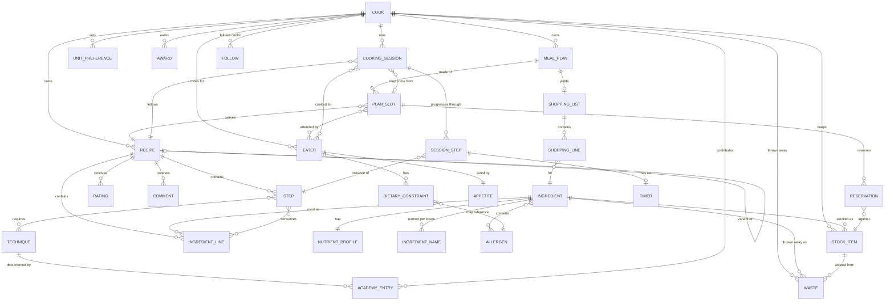

# Domain model

**Status: Built through [Phase 6b](08-roadmap.md#phase-6b--one-product-not-five-screens) — 21
SQLModel tables behind 20 Alembic migrations. Academy and community concepts are still Planned, and
the [open questions](#open-questions) below remain open.**

This describes *concepts and their relationships*, not tables. The physical schema is an
implementation detail of the resource access layer (V13) and may differ — that is the point of
putting it behind domain verbs.

## The canonical recipe

Everything in Quookly rests on one decision: a recipe is structured data, and prose is a rendering
of it. Concretely, a recipe is:

| Element | Description |
| --- | --- |
| **Yield** | What the quantities produce — servings, or a mass or volume. Every quantity is relative to this. |
| **Ingredient lines** | An ordered set of (ingredient, quantity, unit, preparation note, optionality). |
| **Steps** | An ordered set of actions, with timings, temperatures, and equipment. *Built*, including each step's *attention* — hands-on, waiting, or ahead ([ADR-037](07-decisions.md#adr-037-how-long-a-recipe-takes-is-two-numbers-both-derived)). The ingredient lines a step uses are **derived from its words** rather than tagged ([ADR-040](07-decisions.md#adr-040-a-steps-ingredients-are-read-out-of-its-words-not-tagged)): nothing is stored, and an imported recipe gets them for nothing. |
| **Technique references** | Links from steps into the Academy, so an unfamiliar term is one click from its definition. *Planned with the Academy.* |
| **Provenance** | How this recipe came to exist: authored, imported from JSON, scraped from a URL, generated, or derived. |
| **Visibility** | Private by default; explicitly published. |

Duration and temperature are **fields on a step**, not numbers inside its instruction. That is what
lets cooking mode offer a timer without parsing prose, and it is the same argument as structured
ingredient lines applied one level down.

What a recipe is **not**: a title, a body of text, and a photograph. That shape cannot be scaled,
converted, adapted, or planned against, and reproducing it is the failure mode the product exists
to correct.

### Ingredient line versus ingredient

An **ingredient** is a registry entry: "unsalted butter", with density, nutrient profile, allergen
classification, and locale-specific names. An **ingredient line** is a use of one inside a recipe:
"150 g unsalted butter, softened".

The distinction carries most of the product's value. Because lines point at registry entries rather
than holding free text, quantities can be converted (V4), nutrition can be aggregated (V6),
allergens can be determined structurally (V5), stock can be matched (V9), and shopping lists can be
aggregated across recipes (V8). Free-text ingredients would make every one of those impossible.

An ingredient line that cannot be resolved to a registry entry is a **validation failure**, surfaced
to the cook (FR-9). It is never silently stored as text, and never guessed at.

Foreign keys are **enforced**. SQLite ignores them unless each connection asks it not to, and the
silent version of that failure is the worst one: a line referencing an ingredient that does not exist
is accepted, and then vanishes on read. A recipe losing an ingredient without telling anybody is
precisely the failure this product exists to prevent.

**Identity is a slug, not a name.** `unsalted-butter` is what a recipe points at; what it is *called*
is per locale, and there may be several names per locale because recipes say cornflour or cornstarch
and mean one thing. Lookups match on a normalised form, so a cook typing into a form is not typing a
database key, and what comes back is the canonical name for their locale rather than the alias they
happened to type.

The registry is seeded in English, so a name lookup falls back to `en_GB` when the asked-for locale
has no entry — otherwise a Swiss instance could not resolve seeded ingredients until every
translation landed. The fallback is to that one locale only: matching across languages generally
would let *pain* resolve to bread for an English cook.

### Variants

A variant is a recipe derived from another with a stated intent — dietary adaptation, substitution,
or a different scale. It is a full recipe in its own right, linked to its parent by that intent.

Variants are not versions. A version is the same recipe edited over time; a variant is a
deliberately different recipe that shares an ancestor. Both are needed and they are not the same
relationship.

## Entities

## Concept notes

### Cook and Eater

A **Cook** is an account. An **Eater** is a person cooked for, with dietary constraints, an age
band, and no login. A Cook is also an Eater of their own household — the account and the person are
separate concepts, and conflating them would mean the cook's own allergies could only be recorded
by inventing a second account.

### Dietary constraint

A constraint carries a **severity**, and severity changes behaviour:

| Severity | Meaning | Planning behaviour |
| --- | --- | --- |
| `medical` | Anaphylaxis, coeliac, prescribed diet | Hard exclusion. Never overridable. |
| `ethical` | Vegan, religious observance | Hard exclusion by default; overridable only by explicit act. |
| `intolerance` | Discomfort rather than danger | Warn, allow override. |
| `preference` | Dislike | Rank down, do not exclude. |

Without severity every constraint is treated identically, which means either a disliked ingredient
blocks a menu or a life-threatening allergen is presented as a suggestion. Both are wrong. This
distinction is consumed by `SuitabilityEngine` (V5) and is why suitability returns *verdicts with
reasons* rather than a boolean.

Severity also decides what **not knowing** costs. A dislike carries no risk, so an unclassified
ingredient raises no doubt about it; every other severity does.

Allergens are the **fourteen classes** that must be declared on food sold in the EU and Switzerland —
a fixed, externally defined list rather than free text, because a constraint and an ingredient have
to mean the same thing by "nuts" for a verdict to be worth anything. Anything outside those fourteen
is avoided by naming the ingredient instead.

An **optional** ingredient never bars a recipe: it can be left out, and telling a cook to omit the
butter is more useful than refusing them the recipe. It is still reported.

### Classified, or unexamined

A registry entry records both which allergens it contains **and whether anybody has ever looked**.
Those are different facts: an ingredient classified as containing none is safe, and one nobody has
examined is unknown. Storing only a set of allergens would flatten the two, and the flattened value
reads as safe — which is the failure ADR-006 exists to prevent.

The distinction survives export and import. In the interchange format an absent `allergens` field
means unexamined and an empty list means examined and clear, so a recipe crossing between instances
does not quietly become safer than it was. The field is additive and optional, so documents written
before it existed still read — and read as unexamined, which is exactly what they know.

### Reviewed, which is a third thing

A registry entry also records whether anybody has looked at **the entry**. That is not the same
question as whether anybody has classified **the ingredient**, and the two are separate fields
([ADR-051](07-decisions.md#adr-051-whether-an-entry-has-been-reviewed-is-a-different-column-from-whether-it-has-been-classified)).

An import creates entries for names the registry does not know, because a line resolving to nothing
cannot be shopped for, scaled or judged. What it creates is a guess: `SOLID` assumed, no density,
allergens left unexamined. Such an entry is **usable immediately** — refusing an import until an
administrator wakes up would make the feature useless — but it is flagged for review, and an
administrator approves it, corrects it, or merges it away.

Review cannot be read off either of the fields already there. Most of the shipped registry is
unexamined, because the published table could not answer for those rows, and they need no review at
all; and an approved entry stays the cook's own for ever, so provenance cannot say whether anybody
has looked. Approving records the review and nothing else — in particular it never classifies, since
"this entry is a fair description" is not "I know what is inside this food".

### An Academy page

**Designed, not built.** Phase 7, and shaped deliberately like a registry entry, because the same
things go wrong with it.

A page explains one thing a cook might not know. It carries a **kind** — `technique`, `ingredient`,
and whatever sections follow — because the volatility was never "techniques"
([ADR-057](07-decisions.md#adr-057-the-academy-is-sections-of-pages-not-a-table-of-techniques)).
Writing the first fifty found that out immediately: `curdle` is not something you do, it is something
that happens to you, and `al dente` is a doneness.

Every page carries:

- a **slug**, which is its identity, exactly as with an ingredient — the name is not
- a **canonical name and its spellings, per locale**. The spellings are load-bearing rather than
  decorative: they are what lets *"folding"*, *"folded in"* and *"carefully fold"* all reach the
  page for *fold*, and putting the variation here rather than in a similarity score is the whole of
  [ADR-055](07-decisions.md#adr-055-a-step-finds-its-techniques-by-the-words-it-already-uses)
- a short **summary** and a longer **explanation**, per locale
- optional **cautions** — the part where getting it wrong matters
- **pictures**, because a page about julienne without a photograph of julienne is a knife cut
  explained in words
- an **origin**: shipped, or a cook's own. The same meaning as
  [ADR-016](07-decisions.md#adr-016-ship-seed-content-marked-and-upgradable) gives it, and the same
  promise: an upgrade may replace what it shipped and must never touch what a cook wrote
- whether it was **generated**, and separately whether it has been **approved**

Those last two are two fields because they are two questions, the same argument
[ADR-051](07-decisions.md#adr-051-whether-an-entry-has-been-reviewed-is-a-different-column-from-whether-it-has-been-classified)
made for the registry. *Who wrote this* and *has anybody checked it* come apart in every direction: a
cook can write something nobody has read, and an administrator can approve a paragraph a model
composed.

**An ingredient page names a registry entry rather than restating it.** The registry keeps the facts
— kind, density, allergens, published figures — because those are what gets computed on. The page
keeps the prose and the pictures. Nothing is stored twice, and what an engine reads still comes from
the registry.

**Several pages may claim one term in one language**, and that is allowed here where it is refused
in the registry. Nothing computes on a page, so a cook who lands on the wrong one reads a paragraph
about the wrong thing and clicks again — where a recipe line resolving to the wrong ingredient gets
the wrong food's allergens. A page whose term is shared says so at the top and names the others
([ADR-058](07-decisions.md#adr-058-ambiguity-is-shown-where-a-person-resolves-it-and-refused-where-something-computes-on-it)).

**An explanation is never read by anything that computes.** `SuitabilityEngine` and
`NutritionEngine` do not see it, and a layer contract enforces that
([ADR-056](07-decisions.md#adr-056-a-generated-explanation-is-marked-unreviewed-and-never-an-input-to-a-judgement)).
It is shown to a person and nothing else. That containment is what keeps a wrong paragraph a bad
paragraph rather than a wrong verdict.

**A step usually holds no reference to a page.** The terms are read out of the step's own words when
it is displayed, exactly as its ingredient lines are
([ADR-040](07-decisions.md#adr-040-a-steps-ingredients-are-read-out-of-its-words-not-tagged)), so a
recipe imported before a page existed gains the link the day somebody writes it. Where automatic
reading cannot know the answer — which flour *"the flour"* means, which of several pages a term
belongs to — an author may write the link into the instruction as `[[slug|the words as written]]`,
and that wins ([ADR-059](07-decisions.md#adr-059-a-step-may-name-its-own-links-and-a-recipe-may-be-edited)).

### How a verdict is reported

One row per reason, most serious first, each naming the eater and the ingredient. A refusal
a cook cannot act on is barely better than no answer.

An **unclassified ingredient produces one row, not one per constraint**. Nobody has looked at
it, so nothing is known about any allergen in it — that is a single fact, and repeating it
once per constraint fills the verdict with rows that differ in no way a cook can see. The row
carries the gravest of the constraints it bears on, so collapsing can never make a doubt read
milder than it is.

A verdict is **absent rather than *suitable*** when the household is empty. Nobody described
satisfies every constraint there is, and reporting that as a clean bill of health would be a
reassurance about a question nobody asked.

### Stock item and reservation

A **stock item** is a **lot**: some of an ingredient that arrived at one time, with one expiry and
one note about where it came from. Lots rather than a running total per ingredient, because expiry
belongs to a packet — a per-ingredient total can carry only one date, and either warns about two
kilos when 200 g are at risk or never warns at all
([ADR-034](07-decisions.md#adr-034-stock-is-held-as-lots-not-as-a-total-per-ingredient)). The shelf
a cook reads is lots grouped and totalled, which is presentation rather than storage.

A **reservation** links a plan slot to a *lot* it intends to consume. It exists exactly while the
claim is held: releasing deletes it and cooking deletes it, so there is no status to read and no way
for a stale one to keep stock invisible
([ADR-036](07-decisions.md#adr-036-a-reservation-exists-only-while-it-is-held)). How much of a lot
is free is computed from its claims rather than stored beside the quantity.

Where the two disagree, **the fridge wins**. A cook reporting less than a plan claimed is telling the
truth about their own kitchen, so the claim is cut down to what survives and the meal is left needing
shopping for.

Reservations exist so that planning does not lie about the pantry
([ADR-004](07-decisions.md#adr-004-plans-reserve-stock-cooking-consumes-it)). Planned-but-not-yet-cooked
stock is neither freely available nor gone. Two plans cannot reserve the same butter, and a
cancelled plan releases it. Deducting on planning would make the pantry wrong the moment anything
changed.

### Waste

**Waste** is its own record — the ingredient, the amount, the reason and the date — rather than a
subtraction from stock. Waste inferred from a falling quantity cannot be told from food that was
eaten, and "what did we throw away, and why" is a question this product exists to answer
([ADR-035](07-decisions.md#adr-035-adjusting-stock-and-recording-waste-are-different-acts)).

The reason matters more than it looks. *Spoiled* and *expired* are kept apart: food that actually
went off was bought or stored badly, and food binned on its date was very often still fine — which
is the waste a cook can most easily stop.

Correcting a quantity is a different act from wasting it. Adjusting says the number was wrong;
wasting says food left the kitchen. Only the second belongs in the figure the cook is trying to
bring down.

### How much of a recipe a meal makes

A plan slot may carry a **yield the cook stated**, in the recipe's own yield unit — 8 of a recipe
that makes 4 is twice it. Absent is the ordinary case and means the two rules that applied before
anybody could say otherwise: one batch, or as many as the table wants.

It belongs to the slot rather than to a cooking session because the shopping and the reservation are
the slot's, and a session making twice the recipe against a meal that reserved one batch is exactly
the disagreement `Sizing` reports
([ADR-065](07-decisions.md#adr-065-a-yield-the-cook-set-outranks-one-worked-out-from-the-table)).
A stated yield outranks one worked out from the guest list: both say how much to make, and only one
was typed by a person.

### A meal that was cooked

A plan slot records **when** it was cooked, and that is one way. Un-marking would mean re-adding
stock that never came back — the path
[ADR-004](07-decisions.md#adr-004-plans-reserve-stock-cooking-consumes-it) was written to avoid — so
a mistake is corrected in the pantry, where quantities are restated anyway.

A cooked meal is a **record rather than a plan**: it holds no stock, needs no shopping, and is not
edited. It stays in the week, saying what was cooked and who was there.

### How long it takes

*Built — see [ADR-037](07-decisions.md#adr-037-how-long-a-recipe-takes-is-two-numbers-both-derived).*

Two numbers, not one. **Hands-on time** is how long the cook has to be doing something; **total
time** is how long from starting to eating. A cake is twenty minutes of work and ninety of waiting,
and a single figure loses whichever of those the reader was asking about.

Both are derived from the steps rather than stored on the recipe, because a stored total is wrong
from the first step edited. Each step carries an attention of its own — hands-on, waiting, or ahead —
and *ahead* is not a number at all: proving overnight is eight hours in which the cook is asleep, so
it is surfaced as *start the day before* rather than added to a total.

A step with no duration contributes nothing and makes both totals a **lower bound**, marked as such.
Zero would be a lie in the direction that makes every recipe look quicker than it is. Where *nothing*
was timed, there is no answer at all: "at least 0 min" reads as a fact and is not one.

Nothing infers overlap. *While the oven heats, make the batter* is two steps and one stretch of
clock, but a written recipe never says which steps overlap, and guessing would make the total
**shorter** than the truth — the one direction that makes somebody late. A cook who wants the overlap
counted writes it as one step, which is how they would say it out loud.

### Cooking a meal

A **cooking session** is one planned meal being made right now: where the cook has got to, and what
each timer has counted. It is the only stateful thing in the system, and it lives on the server
([ADR-013](07-decisions.md#adr-013-cooking-sessions-are-server-side-state-timers-store-instants))
because a phone locks, a tablet sleeps, and a session that dies with the screen is worse than a
printed page.

It belongs to a **plan slot**, not to a bare recipe
([ADR-042](07-decisions.md#adr-042-a-cooking-session-executes-a-planned-meal)). The plan already
answers "what did we eat on Tuesday", holds the guest list, and holds the stock aside; a meal that
could also exist somewhere else would be a second history of the same dinner.

Where the cook is has three readings, not two. **On the mise-en-place** is where every session
begins and is a real place to come back to — not step zero, and not a missing answer. **On a step**
is a position in the recipe's own list, so a session picked up on another device points at the same
instruction. **Ended** is one way: a session that finished is a record of what happened, and letting
it reopen would be a second history of one meal.

A session ends **completed** or **abandoned**, and the difference is the difference between food that
was eaten and food that was not. Completing states `MealCooked`, which the pantry hears; abandoning
states nothing, because the meal is still planned and still holds its stock.

**Timers hold instants.** Each is a step's own — a kitchen has the oven on while something else
simmers — and each records when it was last started plus what it had already counted. Remaining time
is the client's subtraction, computed afresh every second. Storing the remainder instead goes wrong
the moment anything pauses, disconnects, or resumes elsewhere, and a reduction that quietly loses
four minutes is worse than no timer at all.

### What an ingredient line's number counts

A number at the front of an ingredient line is usually an amount, and sometimes it is not
([ADR-044](07-decisions.md#adr-044-what-a-number-in-an-ingredient-line-counts)).

*"4 cloves garlic"* counts pieces of garlic. The ingredient is **garlic** — read as a name,
"cloves garlic" resolves against no registry and is recorded as a new ingredient nobody has
classified. *"4-inch piece ginger"* counts nothing: it is one piece, four inches long, and
the recipe does not say what that weighs. The amount stays absent and the length becomes the
note, because four gingers is nine times the recipe.

A bracketed aside is always a note, never part of the name, and it is taken out before commas
are looked at — a note in brackets nearly always contains one, and splitting there produced
an ingredient called *"neutral oil ((such as vegetable"*.

### What a recipe contains

Nutrition is **derived, never stored on a recipe** — the same reasoning as the two times it takes
([ADR-037](07-decisions.md#adr-037-how-long-a-recipe-takes-is-two-numbers-both-derived)): a stored
total is wrong from the first quantity edited.

Each figure comes from a **published composition table**, and which table answers is decided against
the instance's configured order
([ADR-045](07-decisions.md#adr-045-composition-data-is-tried-in-a-configured-order-nearest-table-first)).
Composition data measures a food supply rather than an ingredient — US flour is fortified with folic
acid and iron by law and Swiss flour is not — so the shipped order prefers the tables measured
nearest the cook, and USDA is the last resort rather than the base. One table answers for one
ingredient, whole; a value with its protein from one and its fibre from another is a number nobody
measured.

Tables publish per 100 g, so every line has to be **weighed**. A mass converts directly, a volume
goes through the registry's density, and a countable goes through what one of them weighs. That last
number is published by no table Quookly reads, so it ships unset — an egg goes uncounted until
somebody says what one weighs, rather than being given an invented figure.

A line that cannot be weighed, or that no table answers for, contributes nothing and is **named**.
The totals are then floors. A figure that quietly leaves out the butter is worse than no figure.

### A recipe that was asked for

A generated recipe is an ordinary recipe with `provenance = generated`. It goes through the same
resolution, the same registry, and the same judgement as one read off a page — the only thing that
differs is what happens when the judgement goes badly.

An imported recipe with a problem is **kept and marked**: it exists in the world whatever it contains.
A generated one is **refused with its reasons and not kept**
([ADR-047](07-decisions.md#adr-047-a-generated-recipe-is-refused-not-warned-about)), because it was
written on these people's behalf in answer to a request that named them, and producing something they
cannot eat is a failure of the request rather than a fact about a recipe.

The household's constraints go into the asking, which changes the odds. The verdict comes afterwards
from the *resolved* ingredients, which is the guarantee. A model asserting a recipe is dairy-free
carries no weight — and on the first live run, one told not to use milk wrote a recipe with parmesan
in it.

A **version** of a recipe is the same thing with a history: `provenance = derived` and a link to the
recipe it came from. Kept apart from `generated` because the histories differ — one was invented from
nothing and this one started from something the cook already had — and the link is what puts a cook
one tap from the original. A version of a version is an ordinary thing to make, so the link is a plain
self-reference with nothing clever about it.

### A line without a quantity

"Salt, to taste." "Oil, for frying." "A pinch of nutmeg." These are ordinary lines in every
cookbook, and a recipe holding one has to be storable — otherwise importing a real page either
fails or quietly drops the line, and dropping an ingredient is the failure this project refuses.

A missing quantity is **not zero and not one**. A stored zero would scale, render and shop as
nothing; a stored one would misweigh the recipe. So the magnitude and the unit are absent together,
and every path treats that as its own case: scaling leaves the line alone, because twice as much
"to taste" is still "to taste"; the display shows the ingredient and its note with nothing where a
number would go; and the interchange format carries the absence, so a recipe cannot gain a quantity
by crossing between instances.

A magnitude **without** a unit is still refused. Half a *what* is not less information than "half a
cup", it is wrong information.

### How a quantity reads

A count of things needs no unit word: "2 egg" is how a cook writes it, "2 piece egg" is how a
database does. Servings keep their word and take a plural, because "Makes 12" alone loses what is
being made.

**Known limitation.** The rendered `display` string is produced by the backend in English, so unit
*symbols* (g, ml, dl) travel fine but the words "serving" and "servings" do not yet localise. Fixing
it means either returning the parts and formatting in the browser, or rendering per request locale.

### Appetite multiplier

Each Eater carries a multiplier against a standard portion — a teenager at 1.4, a small eater at
0.6, a toddler at 0.3. Required yield is the **sum of the attending eaters' multipliers**, not a
head count (FR-18).

Age band and appetite are separate on purpose. Age band drives *suitability* — whether an infant
should be served honey, whether a dish needs softer texture. Appetite drives *quantity*. Two adults
of the same age eat different amounts, and folding the two into one field would mean either
misjudging portions or misjudging safety. `SuitabilityEngine` reads the age band; `MeasureEngine`
reads the multiplier.

Stored to two decimal places, and rounded there on the way in rather than by the column. The
difference between 1.33 and 1.333 of a serving is not something anybody can plate, and rounding in
the open means the value read back is the value that was written instead of the two disagreeing
until somebody reloads the page.

**What a recipe makes is not how many it serves.** A recipe whose yield reads "12 pancakes" states a
count of pancakes, and nothing in it says how many pancakes feed one person. `MeasureEngine` can
scale such a recipe to a requested number of pancakes, but not to a table, and it raises
`PortionsUnknown` rather than inventing a pieces-per-serving figure — the same refusal, for the same
reason, as converting mass to volume without a density. Both shipped starter recipes are in this
position.

**Built.** A recipe carries **`serves`** alongside its yield: makes 12, serves 4.
`MeasureEngine.scaling_for` reads whichever of the two answers.

`serves` is absent where the yield is already in servings — that yield *is* the answer, and a second
copy of one number is how the two come to disagree. It is also absent where the recipe simply does
not say, and that stays a real answer: nothing infers a pieces-per-serving figure, from a page, from
a model, or on the way to a screen. A wrong one would misportion every meal planned from that recipe,
silently.

Both shipped starter recipes now state it. Reading it survives a round trip through the interchange
format, which gained it in
[format 2](07-decisions.md#adr-012-export-format-is-the-import-format).

### Reading a recipe that is not in English

Quookly ships in en-GB, de-CH and fr-CH (FR-10), so a Swiss cook pasting a link to a Swiss recipe
site is the ordinary case rather than an edge one. Three things differ, and all three change the
number a cook ends up cooking with.

**The decimal separator is a comma.** "2,5 dl Milch" is two and a half decilitres. A reader that
treats every comma as the start of a note turns that into "2", with "5 dl Milch" as a remark.

**Spoons are abbreviations of local words.** `TL` and `EL` are Teelöffel and Esslöffel; `c. à s.`
and `c. à c.` are the French pair. Both are metric — this is the German- and French-speaking world,
not the American one, and the cup exception does not apply.

**A yield counts Portionen, Personen or parts.** A yield word that is not recognised falls through
to being read as a count of things, so "4 Portionen" becomes four pancakes rather than four
servings, and the recipe then refuses to scale to a household.

Vague measures are the same problem in a third language: a Prise, a pincée and a pinch are all
judgements, and all three keep their words and refuse a number.

**Names are the part that matters most.** The registry is defined in English and *named* in every
shipped language. Asked in the wrong one, "Mehl" resolves to nothing, becomes an entry nobody has
classified, and the recipe loses the gluten the registry knew about — while looking exactly like a
recipe that had been judged and found clear. See
[ADR-031](07-decisions.md#adr-031-an-imported-recipe-is-resolved-in-the-pages-own-language).

### A recipe's prose in another language

A recipe is **stored in the language it was written in and read in yours**
([ADR-032](07-decisions.md#adr-032-recipes-are-stored-in-their-own-language-and-read-in-yours)). What
is translated is prose only — the title, the summary and each step. Quantities, durations and
temperatures are columns rendered per cook, and ingredient names resolve through the registry per
locale, so a translation *cannot* change what a recipe asks for. No verdict is affected, because no
verdict has ever consulted prose.

A stored translation carries three things beyond its words.

**Which language**, and **who wrote it** — a machine or a person. Both are translations and only one
is somebody's work, so the reader is told which they are looking at, and a model never replaces a
person's ([ADR-064](07-decisions.md#adr-064-a-translation-records-what-it-translated-and-a-persons-words-are-not-re-derived)).

**A fingerprint of the words it translated.** Not a `stale` flag: a flag has to be set by every write
path, and the one somebody forgets shows a cook instructions for a step that was rewritten. A
translation whose fingerprint no longer matches the recipe **is not used** — invalidation by
construction, so editing a recipe needs to know nothing about translations. A machine's is then
derived again; a person's is kept and stopped being shown, and the reader sees the recipe's own
language, which is honest and is what an instance with no model shows anyway.

Steps are paired back to the recipe **by position**, which is why a translation with a different
number of steps is refused rather than repaired: one step short puts step three's words on step two,
and that is a wrong instruction rather than a badly worded one.

A recipe also records **the language it is written in**, as a bare code — `de`, not `de-CH`. Read
from the page on import, taken from the cook's own language for anything written here, and **absent
where nobody knows**. Absent is a real answer, and guessing at it would be inventing the one fact
this exists to stop inventing.

### Units that quietly disagree

A US cup is 236.6 ml; a metric cup is 250 ml. A US tablespoon is 14.8 ml; a metric one is 15 ml. US
and imperial fluid ounces differ again.

They are **separate units**, not one unit with a regional footnote. Conflating them is a 6% error on
every ingredient measured that way, applied silently, and it is one of the ways a scraped recipe goes
wrong without anybody noticing. Swiss and German recipes are written in **decilitres**, which is why
`dl` is a first-class unit rather than something to convert away.

Magnitudes are decimals rather than floats. Recipes are scaled repeatedly and appetite multipliers
sum to values like 3.5; binary drift in a quantity is a wrong recipe.

Mass and volume convert into each other **only** with the ingredient's density, and `MeasureEngine`
refuses without one rather than assuming water — an assumption that would misweigh every dry
ingredient, flour being roughly half the density of water. A count converts to nothing: three eggs
weigh something, but not something the engine can know.

### Unit preference

A per-cook mapping from **ingredient kind** to preferred unit — powders in grams, liquids in
millilitres, and so on — not a global unit system. "Metric" is not a fine enough answer to be useful
in a kitchen, where the same cook may want powders in grams and liquids in decilitres. This is why
`MeasureEngine` takes preferences as an argument rather than reading a system-wide setting.

Every kind has a **default**, merged underneath whatever the cook has chosen. An empty preference set
would show a scraped American recipe in cups to a Swiss cook forever, and callers should never have
to reason about a partially configured cook.

Rendering is a *display* operation: it converts to the preferred unit, moves to a readable one — 1500
g reads as 1.5 kg — and rounds to a precision a cook can act on. The **stored** quantity stays exact,
because rounding on the way in would compound every time the recipe was scaled. A quantity that
cannot be converted, for want of a density, is shown as written rather than failing the page.

### Nutrient profile and confidence

A nutrient profile carries a **confidence** alongside its figures. A registry entry sourced from a
reference database is not the same as one estimated by a model, and presenting them identically
would misrepresent both. Nutrition is decision support, not medical advice
([Non-goals](01-vision.md#non-goals)).

It also carries its **source and licence** (FR-20). The base dataset is USDA FoodData Central, which
is CC0 and demands nothing, but the regional overlays are not: the Swiss Food Composition Database,
CoFID, and Ciqual all require attribution. Recording provenance per profile is what lets an instance credit exactly the sources it
actually uses, and what makes swapping or layering datasets a data change rather than a code change.
See [ADR-007](07-decisions.md#adr-007-nutrition-data-usda-fooddata-central-as-the-base).

### Cooking session

A session is a cook working through one recipe at one moment: the scaled recipe, the execution plan,
the current step, timer states, and an outcome of completed or abandoned.

It is the only genuinely stateful, real-time concept in the system, and it lives on the server
(FR-13) so that a locked phone, a switched device, or a closed tab does not lose it.

**Timers store instants, not remaining seconds.** A timer holds the moment it was started and any
accumulated paused duration; the client computes what is left and ticks the display. Storing
"seven minutes remaining" would be wrong the moment anything paused, disconnected, or resumed
elsewhere — and a reduction that quietly loses four minutes is worse than no timer.

~~A session's relationship to a plan slot is optional.~~ **It is not, and the change was the point.**
Cooking something on a whim is still the common case and still must not require a cook to plan
first — but what happens instead of a nullable slot is that the meal is *put on the plan* and then
cooked by the path that already exists
([ADR-042](07-decisions.md#adr-042-a-cooking-session-executes-a-planned-meal)). A meal
that is not on the plan holds no stock, so a session that finished would consume nothing: the
optional relationship was a session that could not do the one thing sessions are for.

### Academy entry and technique

An **Academy page** explains one thing a cook might not know. It carries a **kind** rather than being
a technique, because the volatility was never "techniques": `curdle` is not something you do,
`al dente` is a doneness, and a food deserves a page of its own
([ADR-057](07-decisions.md#adr-057-the-academy-is-sections-of-pages-not-a-table-of-techniques)).

A page is found by **the words a step already uses** rather than by tagging: each page carries its
spellings per locale, and a step is matched against them
([ADR-055](07-decisions.md#adr-055-a-step-finds-its-techniques-by-the-words-it-already-uses)).
Several pages may claim one term, and the answer is the set rather than a pick
([ADR-058](07-decisions.md#adr-058-ambiguity-is-shown-where-a-person-resolves-it-and-refused-where-something-computes-on-it)).

Two facts about a page are deliberately separate: **who wrote it** — a person here or a model — and
**whether anybody has read it**. An unreviewed page is readable and does not attach itself to
anybody's recipe
([ADR-060](07-decisions.md#adr-060-an-unreviewed-page-can-be-read-but-cannot-attach-itself-to-somebody-elses-recipe)),
and nothing a model wrote is ever an input to a judgement
([ADR-056](07-decisions.md#adr-056-a-generated-explanation-is-marked-unreviewed-and-never-an-input-to-a-judgement)).

A page about a **food** names a registry entry and shows that entry's facts by *reading* them rather
than holding a copy, so correcting the registry corrects every page about it
([ADR-061](07-decisions.md#adr-061-an-ingredient-page-names-its-entry-and-never-restates-what-the-registry-computes-on)).

Pages are contributed by Cooks, which is what connects the Academy to engagement (V11) —
contribution is an activity that earns recognition.

## Seeded content

A fresh instance ships with a usable ingredient registry and a set of starter recipes (FR-17,
UC-10.4). Every such record carries its **origin** — seeded or user-created — and that field does
real work rather than being metadata for its own sake:

- Upgrades may replace seeded records and must never touch user-created ones.
- A cook who edits a seeded recipe gets a **variant** owned by them, leaving the seeded original
  intact. The variant relationship already exists for dietary adaptation, so editing a starter
  recipe needs no new concept.
- Seeded ingredients are instance-wide; user additions layer on top and shadow them by name within
  that instance.

This settles part of the registry ownership question below: ship a curated base, allow local
additions, never let an upgrade overwrite a cook's work. See
[ADR-016](07-decisions.md#adr-016-ship-seed-content-marked-and-upgradable).

## Identity and localisation

Ingredient names are **per locale**, not translated at render time. "Cornflour" in `en_GB`,
"Maizena" colloquially in `fr_CH` — these are different names for a registry entry, not string
translations of each other, and some have no clean equivalent. Recipe content is stored against a
locale; UI strings are separate and handled by the `Localisation` utility (V14).

## Open questions

Recorded rather than guessed at; each affects the schema and should be settled before it is written:

1. ~~**Nutrition source.**~~ *Settled* by
   [ADR-007](07-decisions.md#adr-007-nutrition-data-usda-fooddata-central-as-the-base): USDA
   FoodData Central (CC0) as the base, with the Swiss Food Composition Database overlaying `de_CH`
   and `fr_CH`, and CoFID overlaying `en_GB`. All three verified; both overlays require attribution.
2. **Recipe versioning.** Is edit history retained, and do plans reference a version or the current
   state? Affects whether a cooked meal can be reproduced exactly. **Now pressing rather than
   theoretical**: [ADR-059](07-decisions.md#adr-059-a-step-may-name-its-own-links-and-a-recipe-may-be-edited)
   makes recipes editable, and the first cut edits in place and keeps no history — the honest simple
   answer, and not obviously the right one.
3. **Ingredient registry ownership.** *Partly settled* by
   [ADR-016](07-decisions.md#adr-016-ship-seed-content-marked-and-upgradable): a seeded base plus
   local additions. Still open is whether instances can *share* curated additions with each other,
   and who curates the base set per locale.
4. **Session concurrency.** Can one cook run two sessions at once — a main and a side dish? Likely
   yes, which means reservations and step guidance must not assume a single active session.
5. **Multi-cook households.** Can two accounts share one pantry and plan? Plausible and common;
   changes ownership from Cook to a household concept.
