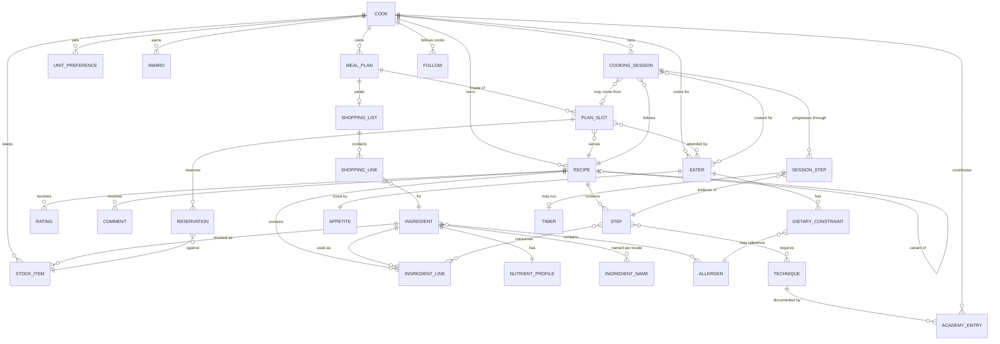

# Domain model

**Status: Planned. No schema exists yet.**

This describes *concepts and their relationships*, not tables. The physical schema is an
implementation detail of the resource access layer (V13) and may differ — that is the point of
putting it behind domain verbs.

## The canonical recipe

Everything in Quookly rests on one decision: a recipe is structured data, and prose is a rendering
of it. Concretely, a recipe is:

| Element | Description |
| --- | --- |
| **Yield** | What the quantities produce — servings, or a mass or volume. Every quantity is relative to this. |
| **Ingredient lines** | An ordered set of (ingredient, quantity, unit, preparation note, optionality). |
| **Steps** | An ordered set of actions, with timings, temperatures, and equipment. *Built.* References to the ingredient lines a step consumes arrive with cooking mode, which is what needs them. |
| **Technique references** | Links from steps into the Academy, so an unfamiliar term is one click from its definition. *Planned with the Academy.* |
| **Provenance** | How this recipe came to exist: authored, imported from JSON, scraped from a URL, generated, or derived. |
| **Visibility** | Private by default; explicitly published. |

Duration and temperature are **fields on a step**, not numbers inside its instruction. That is what
lets cooking mode offer a timer without parsing prose, and it is the same argument as structured
ingredient lines applied one level down.

What a recipe is **not**: a title, a body of text, and a photograph. That shape cannot be scaled,
converted, adapted, or planned against, and reproducing it is the failure mode the product exists
to correct.

### Ingredient line versus ingredient

An **ingredient** is a registry entry: "unsalted butter", with density, nutrient profile, allergen
classification, and locale-specific names. An **ingredient line** is a use of one inside a recipe:
"150 g unsalted butter, softened".

The distinction carries most of the product's value. Because lines point at registry entries rather
than holding free text, quantities can be converted (V4), nutrition can be aggregated (V6),
allergens can be determined structurally (V5), stock can be matched (V9), and shopping lists can be
aggregated across recipes (V8). Free-text ingredients would make every one of those impossible.

An ingredient line that cannot be resolved to a registry entry is a **validation failure**, surfaced
to the cook (FR-9). It is never silently stored as text, and never guessed at.

Foreign keys are **enforced**. SQLite ignores them unless each connection asks it not to, and the
silent version of that failure is the worst one: a line referencing an ingredient that does not exist
is accepted, and then vanishes on read. A recipe losing an ingredient without telling anybody is
precisely the failure this product exists to prevent.

**Identity is a slug, not a name.** `unsalted-butter` is what a recipe points at; what it is *called*
is per locale, and there may be several names per locale because recipes say cornflour or cornstarch
and mean one thing. Lookups match on a normalised form, so a cook typing into a form is not typing a
database key, and what comes back is the canonical name for their locale rather than the alias they
happened to type.

The registry is seeded in English, so a name lookup falls back to `en_GB` when the asked-for locale
has no entry — otherwise a Swiss instance could not resolve seeded ingredients until every
translation landed. The fallback is to that one locale only: matching across languages generally
would let *pain* resolve to bread for an English cook.

### Variants

A variant is a recipe derived from another with a stated intent — dietary adaptation, substitution,
or a different scale. It is a full recipe in its own right, linked to its parent by that intent.

Variants are not versions. A version is the same recipe edited over time; a variant is a
deliberately different recipe that shares an ancestor. Both are needed and they are not the same
relationship.

## Entities

## Concept notes

### Cook and Eater

A **Cook** is an account. An **Eater** is a person cooked for, with dietary constraints, an age
band, and no login. A Cook is also an Eater of their own household — the account and the person are
separate concepts, and conflating them would mean the cook's own allergies could only be recorded
by inventing a second account.

### Dietary constraint

A constraint carries a **severity**, and severity changes behaviour:

| Severity | Meaning | Planning behaviour |
| --- | --- | --- |
| `medical` | Anaphylaxis, coeliac, prescribed diet | Hard exclusion. Never overridable. |
| `ethical` | Vegan, religious observance | Hard exclusion by default; overridable only by explicit act. |
| `intolerance` | Discomfort rather than danger | Warn, allow override. |
| `preference` | Dislike | Rank down, do not exclude. |

Without severity every constraint is treated identically, which means either a disliked ingredient
blocks a menu or a life-threatening allergen is presented as a suggestion. Both are wrong. This
distinction is consumed by `SuitabilityEngine` (V5) and is why suitability returns *verdicts with
reasons* rather than a boolean.

### Stock item and reservation

A **stock item** is a quantity of an ingredient, with optional expiry and a source. A
**reservation** links a plan slot to stock it intends to consume.

Reservations exist so that planning does not lie about the pantry
([ADR-004](07-decisions.md#adr-004-plans-reserve-stock-cooking-consumes-it)). Planned-but-not-yet-cooked
stock is neither freely available nor gone. Two plans cannot reserve the same butter, and a
cancelled plan releases it. Deducting on planning would make the pantry wrong the moment anything
changed.

### Appetite multiplier

Each Eater carries a multiplier against a standard portion — a teenager at 1.4, a small eater at
0.6, a toddler at 0.3. Required yield is the **sum of the attending eaters' multipliers**, not a
head count (FR-18).

Age band and appetite are separate on purpose. Age band drives *suitability* — whether an infant
should be served honey, whether a dish needs softer texture. Appetite drives *quantity*. Two adults
of the same age eat different amounts, and folding the two into one field would mean either
misjudging portions or misjudging safety. `SuitabilityEngine` reads the age band; `MeasureEngine`
reads the multiplier.

### Units that quietly disagree

A US cup is 236.6 ml; a metric cup is 250 ml. A US tablespoon is 14.8 ml; a metric one is 15 ml. US
and imperial fluid ounces differ again.

They are **separate units**, not one unit with a regional footnote. Conflating them is a 6% error on
every ingredient measured that way, applied silently, and it is one of the ways a scraped recipe goes
wrong without anybody noticing. Swiss and German recipes are written in **decilitres**, which is why
`dl` is a first-class unit rather than something to convert away.

Magnitudes are decimals rather than floats. Recipes are scaled repeatedly and appetite multipliers
sum to values like 3.5; binary drift in a quantity is a wrong recipe.

Mass and volume convert into each other **only** with the ingredient's density, and `MeasureEngine`
refuses without one rather than assuming water — an assumption that would misweigh every dry
ingredient, flour being roughly half the density of water. A count converts to nothing: three eggs
weigh something, but not something the engine can know.

### Unit preference

A per-cook mapping from **ingredient kind** to preferred unit — powders in grams, liquids in
millilitres, and so on — not a global unit system. "Metric" is not a fine enough answer to be useful
in a kitchen, where the same cook may want powders in grams and liquids in decilitres. This is why
`MeasureEngine` takes preferences as an argument rather than reading a system-wide setting.

Every kind has a **default**, merged underneath whatever the cook has chosen. An empty preference set
would show a scraped American recipe in cups to a Swiss cook forever, and callers should never have
to reason about a partially configured cook.

Rendering is a *display* operation: it converts to the preferred unit, moves to a readable one — 1500
g reads as 1.5 kg — and rounds to a precision a cook can act on. The **stored** quantity stays exact,
because rounding on the way in would compound every time the recipe was scaled. A quantity that
cannot be converted, for want of a density, is shown as written rather than failing the page.

### Nutrient profile and confidence

A nutrient profile carries a **confidence** alongside its figures. A registry entry sourced from a
reference database is not the same as one estimated by a model, and presenting them identically
would misrepresent both. Nutrition is decision support, not medical advice
([Non-goals](01-vision.md#non-goals)).

It also carries its **source and licence** (FR-20). The base dataset is USDA FoodData Central, which
is CC0 and demands nothing, but the regional overlays are not: the Swiss Food Composition Database,
CoFID, and Ciqual all require attribution. Recording provenance per profile is what lets an instance credit exactly the sources it
actually uses, and what makes swapping or layering datasets a data change rather than a code change.
See [ADR-007](07-decisions.md#adr-007-nutrition-data-usda-fooddata-central-as-the-base).

### Cooking session

A session is a cook working through one recipe at one moment: the scaled recipe, the execution plan,
the current step, timer states, and an outcome of completed or abandoned.

It is the only genuinely stateful, real-time concept in the system, and it lives on the server
(FR-13) so that a locked phone, a switched device, or a closed tab does not lose it.

**Timers store instants, not remaining seconds.** A timer holds the moment it was started and any
accumulated paused duration; the client computes what is left and ticks the display. Storing
"seven minutes remaining" would be wrong the moment anything paused, disconnected, or resumed
elsewhere — and a reduction that quietly loses four minutes is worse than no timer.

A session's relationship to a plan slot is optional. Cooking something on a whim is the common case
and must not require a plan to exist first; when a session *does* come from a slot, completing it
consumes that slot's reservation.

### Academy entry and technique

A **technique** is referenced by steps; an **Academy entry** documents one, or documents a term,
tip, or module. Entries are contributed by Cooks, which is what connects the Academy to engagement
(V11) — contribution is an activity that earns recognition.

## Seeded content

A fresh instance ships with a usable ingredient registry and a set of starter recipes (FR-17,
UC-10.4). Every such record carries its **origin** — seeded or user-created — and that field does
real work rather than being metadata for its own sake:

- Upgrades may replace seeded records and must never touch user-created ones.
- A cook who edits a seeded recipe gets a **variant** owned by them, leaving the seeded original
  intact. The variant relationship already exists for dietary adaptation, so editing a starter
  recipe needs no new concept.
- Seeded ingredients are instance-wide; user additions layer on top and shadow them by name within
  that instance.

This settles part of the registry ownership question below: ship a curated base, allow local
additions, never let an upgrade overwrite a cook's work. See
[ADR-016](07-decisions.md#adr-016-ship-seed-content-marked-and-upgradable).

## Identity and localisation

Ingredient names are **per locale**, not translated at render time. "Cornflour" in `en_GB`,
"Maizena" colloquially in `fr_CH` — these are different names for a registry entry, not string
translations of each other, and some have no clean equivalent. Recipe content is stored against a
locale; UI strings are separate and handled by the `Localisation` utility (V14).

## Open questions

Recorded rather than guessed at; each affects the schema and should be settled before it is written:

1. ~~**Nutrition source.**~~ *Settled* by
   [ADR-007](07-decisions.md#adr-007-nutrition-data-usda-fooddata-central-as-the-base): USDA
   FoodData Central (CC0) as the base, with the Swiss Food Composition Database overlaying `de_CH`
   and `fr_CH`, and CoFID overlaying `en_GB`. All three verified; both overlays require attribution.
2. **Recipe versioning.** Is edit history retained, and do plans reference a version or the current
   state? Affects whether a cooked meal can be reproduced exactly.
3. **Ingredient registry ownership.** *Partly settled* by
   [ADR-016](07-decisions.md#adr-016-ship-seed-content-marked-and-upgradable): a seeded base plus
   local additions. Still open is whether instances can *share* curated additions with each other,
   and who curates the base set per locale.
4. **Session concurrency.** Can one cook run two sessions at once — a main and a side dish? Likely
   yes, which means reservations and step guidance must not assume a single active session.
5. **Multi-cook households.** Can two accounts share one pantry and plan? Plausible and common;
   changes ownership from Cook to a household concept.
