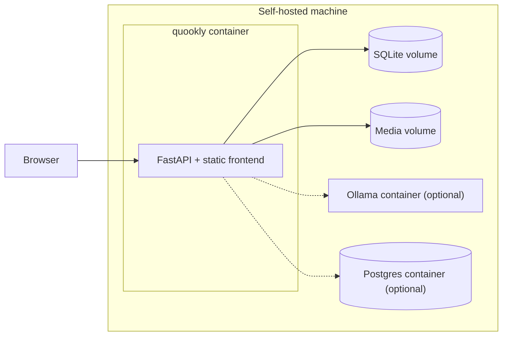

# Installation

Two audiences: people **running** Quookly (self-hosters) and people **working on** it. Running from
source is the only path that works today; see [Development](10-development.md) for the working-on-it
setup, which is the same first four steps.

> **Status.** Running from source is **Built** and verified. The container and Compose deployments
> below are **Planned** — no `Dockerfile` exists in the repository yet. They are recorded here as
> the target so that Phase 8 has a specification, and they are marked so nobody wastes an afternoon
> looking for files that are not there.

## Running from source — Built

### Prerequisites

| Tool | Purpose | Required for |
| --- | --- | --- |
| [uv](https://docs.astral.sh/uv/) | Python dependency and environment management | Backend, CLI |
| [just](https://just.systems/) | Command runner | Everything |
| [nvm](https://github.com/nvm-sh/nvm) | Node version management | Frontend |
| JRE (`openjdk-jre`) | Runs the OpenAPI generator | Codegen only |

Java is needed only to regenerate the frontend API client. It is not needed to run the application.

Python 3.12+ is installed by uv; Node v24.15.0 is installed by nvm from `.nvmrc`. Neither needs to
be present beforehand.

### Install and run

```bash
just install
```

```bash
just openapi
```

```bash
just backend run
```

The second step is not optional on a fresh clone. Both API clients are generated and gitignored, so
without it the frontend will not compile and the CLI cannot reach the API.

The backend listens on port 8000 by default. Override with `PORT`:

```bash
PORT=9000 just backend run
```

### First run

On a fresh instance with no users, Quookly opens a one-time bootstrap path to create the first admin
(UC-10.1). It closes permanently as soon as any user exists (FR-16) — there is no way to reopen it
short of emptying the user table.

**Planned:** the same bootstrap will be available from the CLI for headless installs, and seed
content — a locale-appropriate ingredient registry and starter recipes — will be loaded on first run
([ADR-016](07-decisions.md#adr-016-ship-seed-content-marked-and-upgradable)), so a new instance is
usable rather than empty.

### Verify

```bash
curl -s http://127.0.0.1:8000/api/v1/status
```

Expected: `{"status":"ok"}`. Or through the CLI:

```bash
just cli run status get-status
```

Point the CLI at a different instance with `BASE_URL`. It is read at import time, so it must be set
before the process starts:

```bash
BASE_URL=https://quookly.example.com just cli run status get-status
```

### Serving the frontend

In production the backend serves the compiled Angular application — one process, one port. The
frontend build writes into the backend package:

```bash
just frontend build
```

Output goes to `backend/src/quookly/app/`, and the backend serves it, falling back to `index.html`
so Angular's client-side routes resolve. After building, `http://127.0.0.1:8000/` serves the
application itself.

`FRONTEND_STATIC_DIR` is a relative path, so the backend must run with `backend/` as its working
directory. `just backend run` handles this; a hand-rolled `uvicorn` invocation from elsewhere will
serve 404s for every asset.

For frontend development, run the dev server instead — it proxies nothing, and CORS is open in
development:

```bash
just frontend serve
```

## Container deployment — Planned

**None of this exists yet.** Target shape, per NFR-2:

- One image containing the built frontend and the backend that serves it
- SQLite by default, on a mounted volume — no database server required
  ([ADR-009](07-decisions.md#adr-009-sqlite-by-default-postgres-opt-in))
- Postgres and a local inference backend as optional Compose profiles



Planned configuration surface, all via environment variables so that no file needs editing inside
the image:

| Variable | Purpose | Default |
| --- | --- | --- |
| `PORT` | Listen port | `8000` |
| `QUOOKLY_DATABASE_URL` | Datastore | SQLite on the data volume |
| `QUOOKLY_MEDIA_DIR` | Image storage | Media volume |
| `QUOOKLY_SECRET_KEY` | JWT signing key | none — **must be set** |
| `QUOOKLY_INFERENCE_PROVIDER` | `ollama`, `vllm`, `openai`, `anthropic`, `openrouter` | `ollama` |
| `QUOOKLY_INFERENCE_BASE_URL` | Endpoint for local providers | `http://ollama:11434` |
| `QUOOKLY_INFERENCE_API_KEY` | Credential for hosted providers | none |
| `QUOOKLY_INFERENCE_MODEL` | Model identifier | provider-specific |
| `QUOOKLY_DEFAULT_LOCALE` | `en_GB`, `de_CH`, `fr_CH` | `en_GB` |
| `QUOOKLY_SEED_ON_FIRST_RUN` | Load seed ingredients and starter recipes | `true` |

Names are provisional until Phase 0 implements `Configuration`. The provider variables are the
concrete form of [ADR-003](07-decisions.md#adr-003-inference-is-a-resource-prompting-is-an-activity):
switching from local Ollama to a hosted provider is configuration, never a code change.

### Installing on a phone

Quookly is a PWA ([ADR-015](07-decisions.md#adr-015-mobile-first-installable-and-offline-where-it-matters)),
so it installs to the home screen from the browser with no app store involved. Installing is what
gives the cooking session its full-screen presentation and keeps the shopping list available in a
shop with no signal.

This requires the instance to be served over HTTPS — service workers do not run otherwise, except on
`localhost`. A self-hoster exposing Quookly beyond their LAN needs a certificate; a reverse proxy
terminating TLS is the usual answer.

### Hardware

Per NFR-1, Quookly itself targets 2 cores and 2 GB RAM. **Local inference is the exception and
dominates the requirement** — a machine that runs Quookly comfortably will not necessarily run a
useful model. Two options: run Ollama on a stronger machine on the network and point
`QUOOKLY_INFERENCE_BASE_URL` at it, or use a hosted provider with your own key.

## Upgrading — Planned

Intended shape: pull the new image, restart, and let migrations run at startup. Back up the data
volume first.

Upgrades may replace **seeded** ingredients and recipes and never touch user-created ones
([ADR-016](07-decisions.md#adr-016-ship-seed-content-marked-and-upgradable)). Editing a seeded recipe
produces a user-owned variant, so an improved seed set can ship without discarding a cook's changes. Because export is the same format as import
([ADR-012](07-decisions.md#adr-012-export-format-is-the-import-format)), a full export is also a
valid backup and can be restored into a fresh instance.

## Troubleshooting

**`ModuleNotFoundError` for the API client, or "Unable to import api client. Did you run the
codegen?"** — run `just openapi`. The generated clients are gitignored by design.

**Frontend build fails on imports from `@api`** — same cause, same fix.

**`just frontend <anything>` fails on a missing Node** — the justfile sources nvm and runs
`nvm use` from `.nvmrc`. If nvm is installed somewhere unusual, set `NVM_DIR` before running.

**Codegen fails with a Java error** — the frontend generator needs a JRE. Install `openjdk-jre`.
Backend and CLI codegen do not need it.

**Every asset 404s but the API works** — the backend was started outside `backend/`. Use
`just backend run`.

**Port already in use** — set `PORT`.
