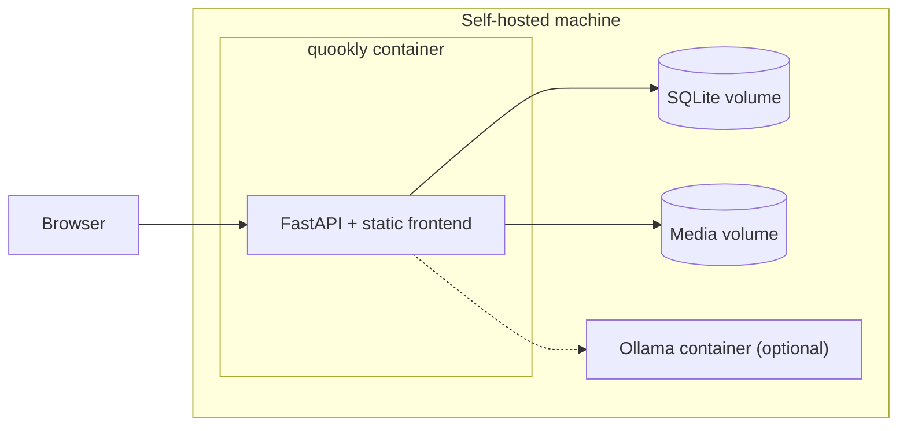

# Installation

Two audiences: people **running** Quookly (self-hosters) and people **working on** it. Running from
source is the only path that works today; see [Development](10-development.md) for the working-on-it
setup, which is the same first four steps.

> **Status.** Running from source is **Built** and verified. The container and Compose deployments
> below are **Planned** — no `Dockerfile` exists in the repository yet. They are recorded here as
> the target so that Phase 8 has a specification, and they are marked so nobody wastes an afternoon
> looking for files that are not there.

## Running from source — Built

### Prerequisites

| Tool | Purpose | Required for |
| --- | --- | --- |
| [uv](https://docs.astral.sh/uv/) | Python dependency and environment management | Backend, CLI |
| [just](https://just.systems/) | Command runner | Everything |
| [nvm](https://github.com/nvm-sh/nvm) | Node version management | Frontend |
| JRE (`openjdk-jre`) | Runs the OpenAPI generator | Codegen only |

Java is needed only to regenerate the frontend API client. It is not needed to run the application.

Python 3.12+ is installed by uv; Node v24.15.0 is installed by nvm from `.nvmrc`. Neither needs to
be present beforehand.

### Install and run

```bash
just install
```

```bash
just openapi
```

```bash
just backend run
```

The second step is not optional on a fresh clone. Both API clients are generated and gitignored, so
without it the frontend will not compile and the CLI cannot reach the API.

The backend listens on port 8000 by default. Override with `PORT`:

```bash
PORT=9000 just backend run
```

### First run

On a fresh instance with no users, Quookly opens a one-time bootstrap path to create the first admin
(UC-10.1). It closes permanently as soon as any user exists (FR-16) — there is no way to reopen it
short of emptying the user table.

The instance stocks its ingredient registry at start-up from the shipped seed file, and claiming it
also installs a couple of starter recipes for the new admin — so the first screen has something on it
([ADR-016](07-decisions.md#adr-016-ship-seed-content-marked-and-upgradable)). Neither ever overwrites
an entry that already exists.

To stock the registry by hand — after replacing the seed file with your own, for instance:

```bash
just backend seed
```

**Planned:** the same bootstrap from the CLI, for headless installs.

### Verify

```bash
curl -s http://127.0.0.1:8000/api/v1/status
```

Expected: `{"status":"ok"}`. Or through the CLI:

```bash
just cli run status get-status
```

Point the CLI at a different instance with `BASE_URL`. It is read at import time, so it must be set
before the process starts:

```bash
BASE_URL=https://quookly.example.com just cli run status get-status
```

### Serving the frontend

In production the backend serves the compiled Angular application — one process, one port. The
frontend build writes into the backend package:

```bash
just frontend build
```

Output goes to `backend/src/quookly/app/`, and the backend serves it, falling back to `index.html`
so Angular's client-side routes resolve. After building, `http://127.0.0.1:8000/` serves the
application itself.

`FRONTEND_STATIC_DIR` is a relative path, so the backend must run with `backend/` as its working
directory. `just backend run` handles this; a hand-rolled `uvicorn` invocation from elsewhere will
serve 404s for every asset.

For frontend development, run the dev server instead — it proxies nothing, and CORS is open in
development:

```bash
just frontend serve
```

## Container deployment — Planned

**None of this exists yet.** Target shape, per NFR-2:

- One image containing the built frontend and the backend that serves it
- SQLite on a mounted volume — no database server required, and the only supported datastore at v1
  ([ADR-009](07-decisions.md#adr-009-sqlite-only-to-begin-with))
- A local inference backend as an optional Compose profile



All configuration is by environment variable, so nothing inside the image needs editing.

**Implemented:**

| Variable | Purpose | Default |
| --- | --- | --- |
| `PORT` | Listen port | `8000` |
| `QUOOKLY_ENVIRONMENT` | `development` or `production` | `development` |
| `QUOOKLY_SECRET_KEY` | JWT signing key | none — see below |
| `QUOOKLY_DATABASE_URL` | Datastore — SQLite only at v1 | `sqlite+aiosqlite:///./quookly.db` |
| `QUOOKLY_TOKEN_LIFETIME_HOURS` | How long a sign-in lasts | `12` |
| `QUOOKLY_LOG_LEVEL` | `DEBUG`, `INFO`, `WARNING`, `ERROR` | `INFO` |

**Planned**, arriving with the phases that use them:

| Variable | Purpose | Arrives with |
| --- | --- | --- |
| `QUOOKLY_MEDIA_DIR` | Image storage | Phase 1 |
| `QUOOKLY_DEFAULT_LOCALE` | `en_GB`, `de_CH`, `fr_CH` | Phase 1 |
| `QUOOKLY_SEED_ON_FIRST_RUN` | Load seed ingredients and starter recipes | Phase 1 |
| `QUOOKLY_INFERENCE_PROVIDER` | `ollama`, `vllm`, `openai`, `anthropic`, `openrouter` | Phase 3 |
| `QUOOKLY_INFERENCE_BASE_URL` | Endpoint for local providers | Phase 3 |
| `QUOOKLY_INFERENCE_API_KEY` | Credential for hosted providers | Phase 3 |
| `QUOOKLY_INFERENCE_MODEL` | Model identifier | Phase 3 |

Settings are added as they are used rather than in anticipation, so this table describes the system
that exists rather than one that is hoped for. The provider variables are the concrete form of
[ADR-003](07-decisions.md#adr-003-inference-is-a-resource-prompting-is-an-activity): switching from
local Ollama to a hosted provider is configuration, never a code change.

### The secret key

There is no default, and this is deliberate
([ADR-019](07-decisions.md#adr-019-no-default-secret-key)):

- **`QUOOKLY_ENVIRONMENT=production`** — `QUOOKLY_SECRET_KEY` must be set. The instance refuses to
  start without it, rather than falling back to something guessable.
- **`development`** (the default) — a throwaway key is generated per process, so a fresh clone runs
  with no configuration. Tokens do not survive a restart.

A supplied key must be **at least 32 bytes**; anything shorter is refused at startup, because an
HS256 key below the hash output length weakens every token signed with it. Generate one with:

```bash
python3 -c "import secrets; print(secrets.token_urlsafe(32))"
```

**Sign-ins cannot be revoked before they expire.** There is no token store yet, so a leaked token
stays valid for its remaining lifetime and signing out is client-side only
([ADR-020](07-decisions.md#adr-020-argon2-via-pwdlib-tokens-via-pyjwt)). Shorten
`QUOOKLY_TOKEN_LIFETIME_HOURS` if that trade is wrong for your instance.

### Installing on a phone

Quookly is a PWA ([ADR-015](07-decisions.md#adr-015-mobile-first-installable-and-offline-where-it-matters)),
so it installs to the home screen from the browser with no app store involved. Installing is what
gives the cooking session its full-screen presentation and keeps the shopping list available in a
shop with no signal.

This requires the instance to be served over HTTPS — service workers do not run otherwise, except on
`localhost`. A self-hoster exposing Quookly beyond their LAN needs a certificate; a reverse proxy
terminating TLS is the usual answer.

### Language and theme

Both are per-browser choices, made in the application footer and remembered locally. Language
follows the browser's preference until chosen — a browser asking for `de-DE` gets `de-CH`, which is
not the same thing but far closer than English. Changing language reloads the page
([ADR-025](07-decisions.md#adr-025-runtime-locale-localize-catalogues-one-artefact)); changing theme
does not.

Nothing about either is server-side, so an instance serves one artefact to everyone
([NFR-2](02-requirements.md#non-functional-requirements)) and a household can disagree about both.

### Hardware

Per NFR-1, Quookly itself targets 2 cores and 2 GB RAM. **Local inference is the exception and
dominates the requirement** — a machine that runs Quookly comfortably will not necessarily run a
useful model. Two options: run Ollama on a stronger machine on the network and point
`QUOOKLY_INFERENCE_BASE_URL` at it, or use a hosted provider with your own key.

## Logs

`production` logs one JSON object per line to stdout, ready to grep or ship. `development` logs for
a human reading a terminal. Set the verbosity with `QUOOKLY_LOG_LEVEL`.

Every request carries an id, returned as the `X-Request-ID` response header and attached to every
line logged while handling it. If a proxy in front of Quookly already sets that header, the value is
adopted rather than replaced, so a trace that started upstream stays whole. When reporting a
problem, the request id is the single most useful thing to include.

Request bodies are never logged, which is what keeps passwords out of the logs
([ADR-022](07-decisions.md#adr-022-standard-library-logging-configured-in-one-place)).

## Upgrading — Planned

Intended shape: pull the new image, restart, and let migrations run at startup. Back up the data
volume first.

### Taking your data with you

```bash
curl -H "Authorization: Bearer $TOKEN" https://your-instance/api/v1/recipes/export > quookly.json
```

That file is a complete, portable copy: the recipes and the registry entries they use. Importing it
into any Quookly instance recreates them, including one that has never seen those ingredients
([ADR-012](07-decisions.md#adr-012-export-format-is-the-import-format)). It is also a valid backup —
the export format and the import format are the same one, so the path out is exercised by every
round trip rather than only by people leaving.

Upgrades may replace **seeded** ingredients and recipes and never touch user-created ones
([ADR-016](07-decisions.md#adr-016-ship-seed-content-marked-and-upgradable)). Editing a seeded recipe
produces a user-owned variant, so an improved seed set can ship without discarding a cook's changes. Because export is the same format as import
([ADR-012](07-decisions.md#adr-012-export-format-is-the-import-format)), a full export is also a
valid backup and can be restored into a fresh instance.

## Troubleshooting

**`ModuleNotFoundError` for the API client, or "Unable to import api client. Did you run the
codegen?"** — run `just openapi`. The generated clients are gitignored by design.

**Frontend build fails on imports from `@api`** — same cause, same fix.

**`just frontend <anything>` fails on a missing Node** — the justfile sources nvm and runs
`nvm use` from `.nvmrc`. If nvm is installed somewhere unusual, set `NVM_DIR` before running.

**Codegen fails with a Java error** — the frontend generator needs a JRE. Install `openjdk-jre`.
Backend and CLI codegen do not need it.

**Every asset 404s but the API works** — the backend was started outside `backend/`. Use
`just backend run`.

**Port already in use** — set `PORT`.

## Pointing the instance at a model

Quookly reads a recipe out of a page's own metadata when the site publishes it, which the large
recipe sites do. A page that does not — a blog, most personally-run sites — has to be read through
by a model, and that is what this configures. **An instance without one is not broken:** every other
part works, and imports from sites that publish properly still work.

Any OpenAI-compatible server ([ADR-026](07-decisions.md#adr-026-one-openai-shaped-wire-format-not-a-provider-plugin-system)):
vLLM, Ollama, llama.cpp or LM Studio locally, or a hosted provider with a key.

| Variable | Meaning |
| --- | --- |
| `QUOOKLY_INFERENCE_BASE_URL` | The API root, ending in `/v1` |
| `QUOOKLY_INFERENCE_MODEL` | Which model to ask for |
| `QUOOKLY_INFERENCE_API_KEY` | Only for a hosted provider; leave unset for a local one |
| `QUOOKLY_INFERENCE_TIMEOUT_SECONDS` | Default 180. A local model on modest hardware is slow |

A local vLLM, for example:

```bash
QUOOKLY_INFERENCE_BASE_URL=http://your-server:8000/v1
QUOOKLY_INFERENCE_MODEL=Qwen/Qwen3-32B
```

Configuration is by environment rather than by a form
([ADR-033](07-decisions.md#adr-033-the-inference-provider-is-configured-by-environment-and-reported-by-the-app)),
so a change takes effect on restart. To check it took:

```bash
QUOOKLY_TOKEN=<an administrator's token> just cli run inference status
```

which prints the address, the model, whether a key is set — never the key — and whether the provider
answered. The same is on the **Settings** screen for administrators.

### Fetching from your own network

By default an instance refuses to fetch a URL that resolves to a private address
([ADR-027](07-decisions.md#adr-027-an-instance-will-not-fetch-its-own-network)): without that, a
pasted link is a way to make the server read your router's admin page. If your recipes genuinely
live on your own network, set `QUOOKLY_ALLOW_PRIVATE_FETCH=true`.

## Connecting an assistant

The instance speaks [MCP](https://modelcontextprotocol.io) at `/mcp`, mounted in the backend
itself rather than run beside it
([ADR-068](07-decisions.md#adr-068-the-mcp-server-is-a-client-in-this-process-not-a-client-of-this-api)).
Nothing to install and nothing to configure: if the API is up, this is up.

**Authentication is the API's.** The same bearer token, and one token is one cook — an agent sees
what the cook whose token it holds sees, and nothing else. Issue it the way you issue any other:

```bash
QUOOKLY_TOKEN=<your token> just cli run status get-status
```

A host that speaks HTTP is pointed straight at the instance:

```json
{"mcpServers": {"quookly": {
  "url": "http://your-instance:8000/mcp",
  "headers": {"Authorization": "Bearer <your token>"}
}}}
```

A host that speaks only **stdio** — several desktop ones do — needs a relay, because the instance
is on a box in a cupboard and the agent is not. The CLI carries one:

```bash
BASE_URL=http://your-instance:8000 QUOOKLY_TOKEN=<your token> python -m quookly_cli mcp
```

It has no logic in it. What crosses is JSON-RPC, unread.

### What it can do, and what it cannot

It can see the pantry and what is about to go off, read and search recipes, look up a food in the
registry, read the Academy, plan a meal, and write a recipe into the kitchen.

Two limits are structural rather than configured:

- **It cannot invent an ingredient.** A recipe line takes an `ingredient_id` and never has taken a
  name, so an agent writing a recipe has to find the food in the registry first. The cleanup an
  import leaves behind is not something this had to solve; it is something it cannot cause.
- **It cannot tell anyone a dish is safe.** Allergen and suitability conclusions are computed from
  the structured ingredients of the recipe, never from a model's prose
  ([ADR-006](07-decisions.md#adr-006-allergen-determination-is-structural)),
  and a recipe an agent writes is judged by the same engine as one you typed.

Recipes an agent writes are stored **generated, unapproved and private**. They are yours to read,
correct and approve. Nothing leaves the instance, because nothing here ever does.
